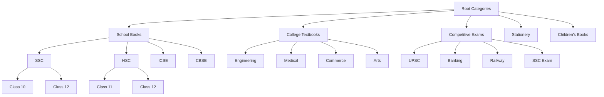
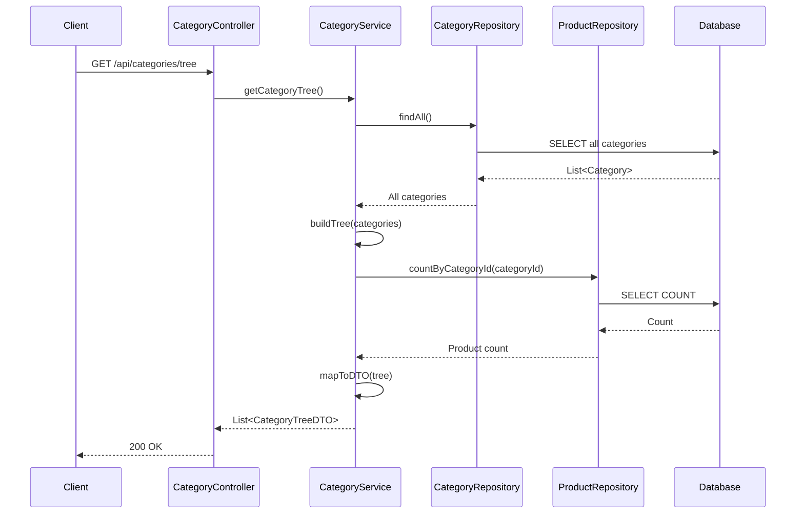
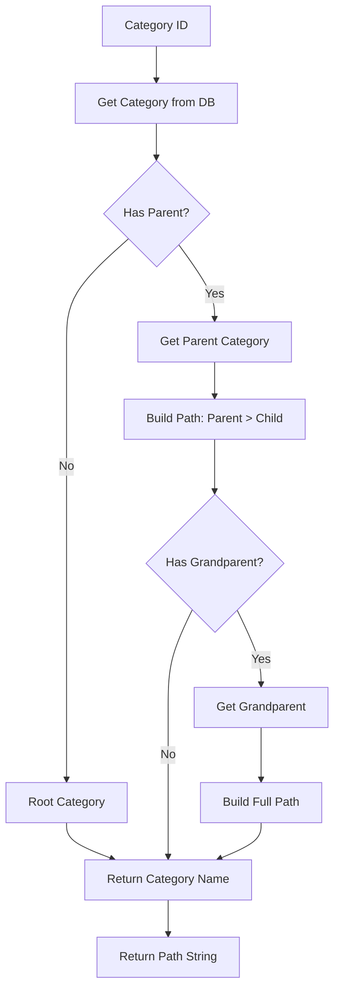
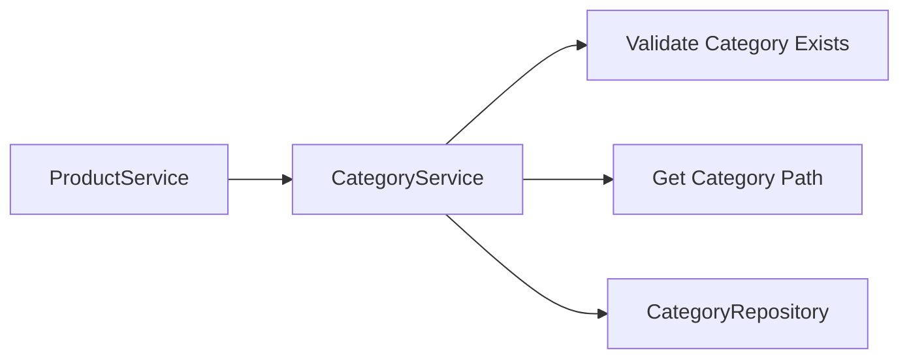

# Category Service Documentation

## Overview

The Category Service manages the hierarchical category structure for organizing products. It supports parent-child relationships, allowing for nested categories and subcategories.

## Service Responsibilities

- Category CRUD operations
- Hierarchical category management
- Category tree structure retrieval
- Category slug generation
- Category validation for products
- Category path resolution

## API Endpoints

### 1. List All Categories

**Endpoint**: `GET /api/categories`

**Description**: Get flat list of all categories

**Query Parameters**:
- `includeSubcategories` (Boolean, default: false): Include subcategories in response

**Response**: `200 OK`
```json
[
  {
    "id": 1,
    "name": "School Books",
    "description": "Textbooks for school students",
    "parentCategoryId": null,
    "parentCategoryName": null,
    "slug": "school-books",
    "level": 0,
    "createdAt": "2025-12-23T10:00:00Z"
  },
  {
    "id": 2,
    "name": "SSC",
    "description": "State Board books",
    "parentCategoryId": 1,
    "parentCategoryName": "School Books",
    "slug": "school-books-ssc",
    "level": 1,
    "createdAt": "2025-12-23T10:00:00Z"
  }
]
```

**Authorization**: Public

### 2. Get Category by ID

**Endpoint**: `GET /api/categories/{id}`

**Description**: Get category details with subcategories

**Path Parameters**:
- `id` (Long): Category ID

**Response**: `200 OK`
```json
{
  "id": 1,
  "name": "School Books",
  "description": "Textbooks for school students",
  "parentCategoryId": null,
  "parentCategoryName": null,
  "slug": "school-books",
  "level": 0,
  "subcategories": [
    {
      "id": 2,
      "name": "SSC",
      "description": "State Board books",
      "parentCategoryId": 1,
      "slug": "school-books-ssc",
      "level": 1,
      "subcategories": []
    },
    {
      "id": 3,
      "name": "HSC",
      "description": "Higher Secondary books",
      "parentCategoryId": 1,
      "slug": "school-books-hsc",
      "level": 1,
      "subcategories": []
    }
  ],
  "productCount": 150,
  "createdAt": "2025-12-23T10:00:00Z",
  "updatedAt": "2025-12-23T10:00:00Z"
}
```

**Authorization**: Public

**Error Responses**:
- `404 Not Found`: Category not found

### 3. Get Category Tree

**Endpoint**: `GET /api/categories/tree`

**Description**: Get complete hierarchical category tree structure

**Response**: `200 OK`
```json
[
  {
    "id": 1,
    "name": "School Books",
    "description": "Textbooks for school students",
    "slug": "school-books",
    "level": 0,
    "subcategories": [
      {
        "id": 2,
        "name": "SSC",
        "slug": "school-books-ssc",
        "level": 1,
        "subcategories": [
          {
            "id": 4,
            "name": "Class 10",
            "slug": "school-books-ssc-class-10",
            "level": 2,
            "subcategories": []
          }
        ]
      }
    ]
  },
  {
    "id": 5,
    "name": "College Textbooks",
    "description": "Books for college students",
    "slug": "college-textbooks",
    "level": 0,
    "subcategories": []
  }
]
```

**Authorization**: Public

### 4. Create Category

**Endpoint**: `POST /api/categories`

**Description**: Create a new category (owner only)

**Headers**: `Authorization: Bearer {token}`

**Request Body**:
```json
{
  "name": "Competitive Exams",
  "description": "Books for competitive exam preparation",
  "parentCategoryId": null
}
```

**Response**: `201 Created`
```json
{
  "id": 6,
  "name": "Competitive Exams",
  "description": "Books for competitive exam preparation",
  "parentCategoryId": null,
  "slug": "competitive-exams",
  "level": 0,
  "createdAt": "2025-12-23T11:00:00Z"
}
```

**Authorization**: OWNER only

**Validation Rules**:
- Name is required and must be unique at the same level
- Parent category must exist if provided
- Cannot create circular references

### 5. Update Category

**Endpoint**: `PUT /api/categories/{id}`

**Description**: Update an existing category (owner only)

**Headers**: `Authorization: Bearer {token}`

**Path Parameters**:
- `id` (Long): Category ID

**Request Body**:
```json
{
  "name": "Competitive Exam Guides",
  "description": "Updated description",
  "parentCategoryId": null
}
```

**Response**: `200 OK` (Updated category)

**Authorization**: OWNER only

**Error Responses**:
- `404 Not Found`: Category not found
- `400 Bad Request`: Invalid parent category or circular reference

### 6. Delete Category

**Endpoint**: `DELETE /api/categories/{id}`

**Description**: Delete a category (owner only)

**Headers**: `Authorization: Bearer {token}`

**Path Parameters**:
- `id` (Long): Category ID

**Response**: `204 No Content`

**Authorization**: OWNER only

**Error Responses**:
- `404 Not Found`: Category not found
- `409 Conflict`: Category has subcategories or products

**Business Rules**:
- Cannot delete category with subcategories
- Cannot delete category with associated products
- Must delete subcategories first

## Category Hierarchy Structure



## Service Flow



## Category Entity

```java
@Entity
@Table(name = "categories")
public class Category {
    @Id
    @GeneratedValue(strategy = GenerationType.IDENTITY)
    private Long id;
    
    @Column(nullable = false)
    private String name;
    
    @Column(columnDefinition = "TEXT")
    private String description;
    
    @ManyToOne
    @JoinColumn(name = "parent_category_id")
    private Category parentCategory;
    
    @Column(unique = true)
    private String slug;
    
    @OneToMany(mappedBy = "parentCategory", cascade = CascadeType.ALL)
    private List<Category> subcategories;
    
    @OneToMany(mappedBy = "category")
    private List<Product> products;
    
    @CreationTimestamp
    private LocalDateTime createdAt;
    
    @UpdateTimestamp
    private LocalDateTime updatedAt;
}
```

## Service Methods

### CategoryService Interface

```java
public interface CategoryService {
    List<CategoryDTO> getAllCategories(boolean includeSubcategories);
    CategoryDTO getCategoryById(Long id);
    CategoryTreeDTO getCategoryTree();
    CategoryDTO createCategory(CreateCategoryRequest request);
    CategoryDTO updateCategory(Long id, UpdateCategoryRequest request);
    void deleteCategory(Long id);
    String getCategoryPath(Long categoryId);
    boolean existsById(Long id);
    Category findById(Long id);
    void validateCategoryExists(Long categoryId);
}
```

## Category Path Resolution

### Path Building Algorithm



### Example Paths

- "School Books" → "School Books"
- "SSC" (child of "School Books") → "School Books > SSC"
- "Class 10" (child of "SSC") → "School Books > SSC > Class 10"

## Slug Generation

### Slug Rules

- Convert to lowercase
- Replace spaces with hyphens
- Remove special characters
- Include parent slug prefix for uniqueness
- Example: "School Books" → "school-books"
- Example: "SSC" (under "School Books") → "school-books-ssc"

### Slug Uniqueness

- Slugs must be unique within the same parent category
- If duplicate, append numeric suffix
- Example: "school-books", "school-books-2"

## Tree Building Algorithm

### Recursive Tree Construction

```java
public CategoryTreeDTO buildTree(List<Category> categories) {
    // Find root categories (no parent)
    List<Category> roots = categories.stream()
        .filter(c -> c.getParentCategory() == null)
        .collect(Collectors.toList());
    
    // Build tree recursively
    return roots.stream()
        .map(root -> buildTreeNode(root, categories))
        .collect(Collectors.toList());
}

private CategoryTreeDTO buildTreeNode(Category category, List<Category> allCategories) {
    CategoryTreeDTO node = mapToDTO(category);
    
    // Find children
    List<Category> children = allCategories.stream()
        .filter(c -> c.getParentCategory() != null && 
                     c.getParentCategory().getId().equals(category.getId()))
        .collect(Collectors.toList());
    
    // Recursively build children
    node.setSubcategories(children.stream()
        .map(child -> buildTreeNode(child, allCategories))
        .collect(Collectors.toList()));
    
    return node;
}
```

## Database Queries

### Optimized Queries

**Get All Categories with Hierarchy**:
```sql
SELECT 
    c.id,
    c.name,
    c.description,
    c.parent_category_id,
    c.slug,
    p.name as parent_name
FROM categories c
LEFT JOIN categories p ON c.parent_category_id = p.id
ORDER BY c.parent_category_id NULLS FIRST, c.name
```

**Get Category Tree (Recursive)**:
```sql
WITH RECURSIVE category_tree AS (
    SELECT id, name, parent_category_id, slug, 0 as level
    FROM categories
    WHERE parent_category_id IS NULL
    
    UNION ALL
    
    SELECT c.id, c.name, c.parent_category_id, c.slug, ct.level + 1
    FROM categories c
    INNER JOIN category_tree ct ON c.parent_category_id = ct.id
)
SELECT * FROM category_tree
ORDER BY level, name
```

## Performance Considerations

### Caching Strategy

- **Category Tree Cache**: Cache the entire category tree (rarely changes)
- **Category Lookup Cache**: Cache individual category lookups
- **Path Cache**: Cache category paths
- **Cache Invalidation**: Invalidate on category create/update/delete

### Indexing

- **Primary Key**: id (auto-indexed)
- **Index**: parent_category_id (for tree queries)
- **Unique Index**: slug
- **Composite Index**: (parent_category_id, name) for uniqueness check

## Error Handling

### Custom Exceptions

- **CategoryNotFoundException**: When category is not found
- **CategoryNameExistsException**: When category name already exists at same level
- **CircularReferenceException**: When creating circular parent-child relationship
- **CategoryHasSubcategoriesException**: When trying to delete category with children
- **CategoryHasProductsException**: When trying to delete category with products

## Integration with Product Service



- Product Service calls Category Service to validate categories
- Category Service provides category paths for product display
- Category Service provides category tree for navigation

## Testing Considerations

### Unit Tests
- Category creation with/without parent
- Tree building algorithm
- Slug generation
- Path resolution
- Circular reference detection

### Integration Tests
- Complete CRUD operations
- Tree structure retrieval
- Category deletion with constraints
- Category hierarchy validation

## Business Rules

1. **Uniqueness**: Category names must be unique within the same parent
2. **Hierarchy Depth**: Maximum depth of 5 levels (configurable)
3. **Deletion Rules**: Cannot delete category with subcategories or products
4. **Parent Validation**: Parent category must exist and be valid
5. **Circular References**: Cannot create circular parent-child relationships

## Future Enhancements

- Category images/icons
- Category ordering/priority
- Category visibility (active/inactive)
- Category metadata (tags, attributes)
- Bulk category import
- Category analytics (product count, popularity)

