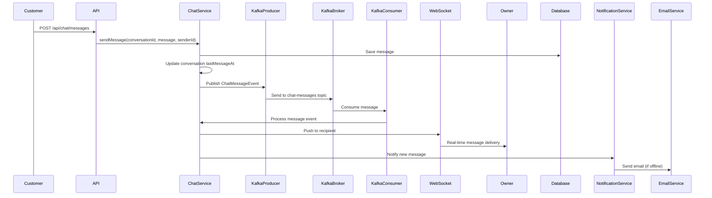
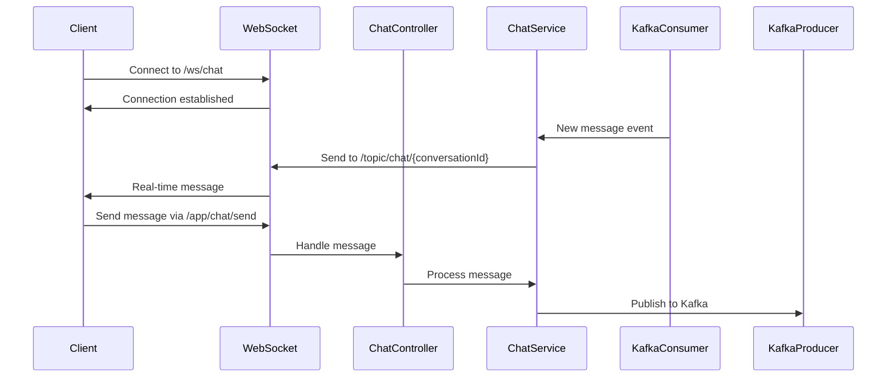
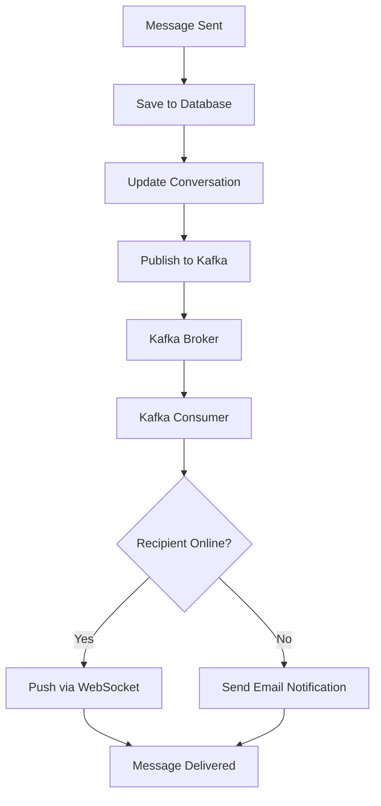
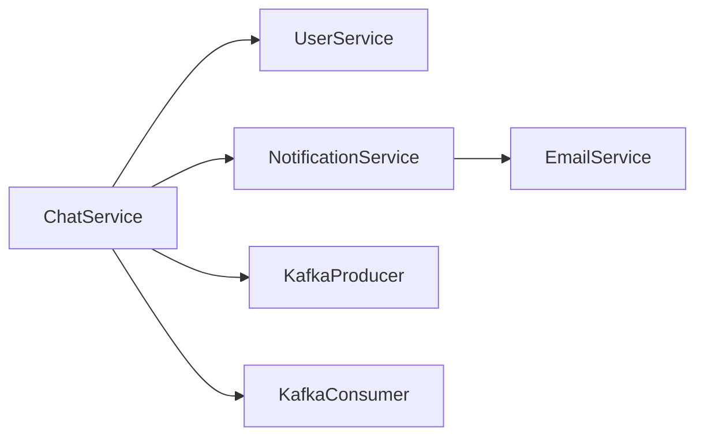

# Chat Service Documentation

## Overview

The Chat Service provides real-time messaging functionality between customers and the store owner. It uses Apache Kafka for message distribution and WebSocket for real-time delivery. The service supports one-to-one conversations with message persistence and read receipts.

## Service Responsibilities

- Conversation management
- Real-time message sending and receiving
- Message persistence
- Read receipt tracking
- Unread message counting
- Kafka integration for message distribution
- WebSocket connection management

## API Endpoints

### 1. Create or Get Conversation

**Endpoint**: `POST /api/chat/conversations`

**Description**: Create a new conversation or get existing conversation with owner

**Headers**: `Authorization: Bearer {token}`

**Request Body**:
```json
{}
```

**Response**: `200 OK` or `201 Created`
```json
{
  "id": 1,
  "customerId": 5,
  "customerName": "John Doe",
  "ownerId": 1,
  "ownerName": "Store Owner",
  "lastMessageAt": "2025-12-23T10:00:00Z",
  "unreadCount": 0,
  "createdAt": "2025-12-23T09:00:00Z"
}
```

**Authorization**: Requires authentication (CUSTOMER)

**Business Rules**:
- Each customer has only one conversation with the owner
- If conversation exists, returns existing conversation
- If not exists, creates new conversation

### 2. List User's Conversations

**Endpoint**: `GET /api/chat/conversations`

**Description**: Get list of conversations for current user

**Headers**: `Authorization: Bearer {token}`

**Query Parameters**:
- `page` (int, default: 0): Page number
- `size` (int, default: 20): Page size

**Response**: `200 OK`
```json
{
  "content": [
    {
      "id": 1,
      "customerId": 5,
      "customerName": "John Doe",
      "ownerId": 1,
      "ownerName": "Store Owner",
      "lastMessage": "Hello, I need help with...",
      "lastMessageAt": "2025-12-23T10:00:00Z",
      "unreadCount": 2,
      "createdAt": "2025-12-23T09:00:00Z"
    }
  ],
  "page": 0,
  "size": 20,
  "totalElements": 1
}
```

**Authorization**: Requires authentication
- CUSTOMER: Returns their conversation with owner
- OWNER: Returns all conversations with customers

### 3. Get Conversation with Messages

**Endpoint**: `GET /api/chat/conversations/{id}`

**Description**: Get conversation details with paginated messages

**Headers**: `Authorization: Bearer {token}`

**Path Parameters**:
- `id` (Long): Conversation ID

**Query Parameters**:
- `page` (int, default: 0): Page number for messages
- `size` (int, default: 50): Page size for messages

**Response**: `200 OK`
```json
{
  "id": 1,
  "customerId": 5,
  "customerName": "John Doe",
  "ownerId": 1,
  "ownerName": "Store Owner",
  "lastMessageAt": "2025-12-23T10:00:00Z",
  "createdAt": "2025-12-23T09:00:00Z",
  "messages": {
    "content": [
      {
        "id": 1,
        "senderId": 5,
        "senderName": "John Doe",
        "message": "Hello, do you have Mathematics Class 10?",
        "read": true,
        "createdAt": "2025-12-23T09:30:00Z"
      },
      {
        "id": 2,
        "senderId": 1,
        "senderName": "Store Owner",
        "message": "Yes, we have it in stock.",
        "read": true,
        "createdAt": "2025-12-23T09:35:00Z"
      }
    ],
    "page": 0,
    "size": 50,
    "totalElements": 2
  }
}
```

**Authorization**: 
- CUSTOMER: Only their own conversations
- OWNER: Any conversation

**Error Responses**:
- `404 Not Found`: Conversation not found
- `403 Forbidden`: Not authorized to view this conversation

### 4. Send Message

**Endpoint**: `POST /api/chat/conversations/{id}/messages`

**Description**: Send a message in a conversation

**Headers**: `Authorization: Bearer {token}`

**Path Parameters**:
- `id` (Long): Conversation ID

**Request Body**:
```json
{
  "message": "Hello, do you have Mathematics Class 10?"
}
```

**Response**: `201 Created`
```json
{
  "id": 1,
  "conversationId": 1,
  "senderId": 5,
  "senderName": "John Doe",
  "message": "Hello, do you have Mathematics Class 10?",
  "read": false,
  "createdAt": "2025-12-23T09:30:00Z"
}
```

**Authorization**: Requires authentication
- Must be participant in the conversation

**Business Rules**:
- Message is saved to database
- Message is published to Kafka topic
- Conversation lastMessageAt is updated
- Unread count is incremented for recipient
- Real-time delivery via WebSocket

### 5. Get Messages

**Endpoint**: `GET /api/chat/conversations/{id}/messages`

**Description**: Get paginated messages for a conversation

**Headers**: `Authorization: Bearer {token}`

**Path Parameters**:
- `id` (Long): Conversation ID

**Query Parameters**:
- `page` (int, default: 0): Page number
- `size` (int, default: 50): Page size

**Response**: `200 OK`
```json
{
  "content": [
    {
      "id": 1,
      "senderId": 5,
      "senderName": "John Doe",
      "message": "Hello, do you have Mathematics Class 10?",
      "read": true,
      "createdAt": "2025-12-23T09:30:00Z"
    }
  ],
  "page": 0,
  "size": 50,
  "totalElements": 10
}
```

**Authorization**: Must be participant in conversation

### 6. Mark Message as Read

**Endpoint**: `PUT /api/chat/messages/{id}/read`

**Description**: Mark a message as read

**Headers**: `Authorization: Bearer {token}`

**Path Parameters**:
- `id` (Long): Message ID

**Response**: `200 OK`
```json
{
  "id": 1,
  "read": true,
  "readAt": "2025-12-23T10:00:00Z"
}
```

**Authorization**: Requires authentication
- Can only mark messages sent to current user as read

### 7. Get Unread Message Count

**Endpoint**: `GET /api/chat/unread-count`

**Description**: Get total unread message count for current user

**Headers**: `Authorization: Bearer {token}`

**Response**: `200 OK`
```json
{
  "unreadCount": 5,
  "conversations": [
    {
      "conversationId": 1,
      "unreadCount": 3
    },
    {
      "conversationId": 2,
      "unreadCount": 2
    }
  ]
}
```

**Authorization**: Requires authentication

### 8. Get All Conversations (Owner Only)

**Endpoint**: `GET /api/chat/conversations/owner/all`

**Description**: Get all conversations for owner

**Headers**: `Authorization: Bearer {token}`

**Query Parameters**:
- `page` (int, default: 0): Page number
- `size` (int, default: 20): Page size
- `unreadOnly` (Boolean, default: false): Filter only unread conversations

**Response**: `200 OK` (Same structure as List Conversations)

**Authorization**: OWNER only

## Real-time Chat Flow with Kafka



## Kafka Integration

### Kafka Topics

#### 1. chat-messages Topic
- **Purpose**: Real-time message distribution
- **Partitions**: 3 (partitioned by conversationId)
- **Replication Factor**: 1 (development), 3 (production)
- **Key**: conversationId (for partitioning)
- **Value**: ChatMessageEvent JSON

**Message Format**:
```json
{
  "messageId": 1,
  "conversationId": 1,
  "senderId": 5,
  "recipientId": 1,
  "message": "Hello, do you have Mathematics Class 10?",
  "timestamp": "2025-12-23T09:30:00Z"
}
```

#### 2. chat-notifications Topic
- **Purpose**: Notification events for chat
- **Partitions**: 1
- **Key**: userId
- **Value**: NotificationEvent JSON

### Kafka Producer Configuration

```java
@Configuration
public class KafkaConfig {
    @Bean
    public ProducerFactory<String, ChatMessageEvent> producerFactory() {
        Map<String, Object> config = new HashMap<>();
        config.put(ProducerConfig.BOOTSTRAP_SERVERS_CONFIG, "localhost:9092");
        config.put(ProducerConfig.KEY_SERIALIZER_CLASS_CONFIG, StringSerializer.class);
        config.put(ProducerConfig.VALUE_SERIALIZER_CLASS_CONFIG, JsonSerializer.class);
        return new DefaultKafkaProducerFactory<>(config);
    }
    
    @Bean
    public KafkaTemplate<String, ChatMessageEvent> kafkaTemplate() {
        return new KafkaTemplate<>(producerFactory());
    }
}
```

### Kafka Consumer Configuration

```java
@KafkaListener(topics = "chat-messages", groupId = "chat-consumer-group")
public void consumeChatMessage(ChatMessageEvent event) {
    // Process message and push via WebSocket
    chatService.deliverMessage(event);
}
```

## WebSocket Integration

### WebSocket Configuration

```java
@Configuration
@EnableWebSocketMessageBroker
public class WebSocketConfig implements WebSocketMessageBrokerConfigurer {
    @Override
    public void configureMessageBroker(MessageBrokerRegistry config) {
        config.enableSimpleBroker("/topic");
        config.setApplicationDestinationPrefixes("/app");
    }
    
    @Override
    public void registerStompEndpoints(StompEndpointRegistry registry) {
        registry.addEndpoint("/ws/chat")
                .setAllowedOrigins("*")
                .withSockJS();
    }
}
```

### WebSocket Message Flow



## Entity Models

### Conversation Entity

```java
@Entity
@Table(name = "conversations")
public class Conversation {
    @Id
    @GeneratedValue(strategy = GenerationType.IDENTITY)
    private Long id;
    
    @ManyToOne
    @JoinColumn(name = "customer_id", nullable = false)
    private User customer;
    
    @ManyToOne
    @JoinColumn(name = "owner_id", nullable = false)
    private User owner;
    
    @Column(name = "last_message_at")
    private LocalDateTime lastMessageAt;
    
    @OneToMany(mappedBy = "conversation", cascade = CascadeType.ALL)
    private List<ChatMessage> messages;
    
    @CreationTimestamp
    private LocalDateTime createdAt;
    
    @UpdateTimestamp
    private LocalDateTime updatedAt;
    
    @PrePersist
    public void setOwner() {
        // Set owner to the single owner user
        this.owner = userService.findOwner();
    }
}
```

### ChatMessage Entity

```java
@Entity
@Table(name = "chat_messages")
public class ChatMessage {
    @Id
    @GeneratedValue(strategy = GenerationType.IDENTITY)
    private Long id;
    
    @ManyToOne
    @JoinColumn(name = "conversation_id", nullable = false)
    private Conversation conversation;
    
    @ManyToOne
    @JoinColumn(name = "sender_id", nullable = false)
    private User sender;
    
    @Column(nullable = false, columnDefinition = "TEXT")
    private String message;
    
    @Column(nullable = false)
    private Boolean read = false;
    
    @CreationTimestamp
    private LocalDateTime createdAt;
}
```

## Service Methods

### ChatService Interface

```java
public interface ChatService {
    ConversationDTO getOrCreateConversation(Long customerId);
    Page<ConversationDTO> getConversations(Long userId, Pageable pageable);
    ConversationDTO getConversationWithMessages(Long conversationId, Long userId, Pageable pageable);
    ChatMessageDTO sendMessage(Long conversationId, String message, Long senderId);
    Page<ChatMessageDTO> getMessages(Long conversationId, Long userId, Pageable pageable);
    void markMessageAsRead(Long messageId, Long userId);
    UnreadCountDTO getUnreadCount(Long userId);
    Page<ConversationDTO> getAllConversationsForOwner(Pageable pageable, boolean unreadOnly);
    void deliverMessage(ChatMessageEvent event);
}
```

## Message Delivery Flow



## Database Queries

### Optimized Queries

**Get Conversation with Unread Count**:
```sql
SELECT 
    c.id,
    c.customer_id,
    c.owner_id,
    c.last_message_at,
    COUNT(CASE WHEN cm.read = false AND cm.sender_id != :userId THEN 1 END) as unread_count
FROM conversations c
LEFT JOIN chat_messages cm ON c.id = cm.conversation_id
WHERE c.customer_id = :userId OR c.owner_id = :userId
GROUP BY c.id
ORDER BY c.last_message_at DESC
```

**Get Messages with Pagination**:
```sql
SELECT 
    cm.id,
    cm.sender_id,
    cm.message,
    cm.read,
    cm.created_at
FROM chat_messages cm
WHERE cm.conversation_id = :conversationId
ORDER BY cm.created_at DESC
LIMIT :size OFFSET :offset
```

## Performance Considerations

### Indexing

- **Primary Key**: id (auto-indexed)
- **Indexes**: conversationId, senderId, createdAt
- **Composite Index**: (conversationId, createdAt) for message queries
- **Composite Index**: (conversationId, read) for unread count queries

### Caching

- **Active Conversations Cache**: Cache active conversation IDs
- **Unread Count Cache**: Cache unread counts (with TTL)
- **WebSocket Connections**: In-memory connection registry

### Kafka Performance

- **Partitioning**: Messages partitioned by conversationId for parallel processing
- **Batch Processing**: Batch message delivery for efficiency
- **Consumer Groups**: Separate consumer groups for different message types

## Error Handling

### Custom Exceptions

- **ConversationNotFoundException**: When conversation is not found
- **UnauthorizedConversationAccessException**: When user tries to access unauthorized conversation
- **InvalidMessageException**: When message is invalid
- **WebSocketConnectionException**: When WebSocket connection fails

## Integration with Other Services



- User Service validates user existence
- Notification Service handles email notifications
- Kafka handles message distribution

## Testing Considerations

### Unit Tests
- Message sending and receiving
- Conversation creation
- Read receipt tracking
- Unread count calculation

### Integration Tests
- Complete message flow with Kafka
- WebSocket message delivery
- Notification triggering
- Error scenarios

## Security Considerations

1. **Authentication**: All endpoints require JWT authentication
2. **Authorization**: Users can only access their own conversations
3. **Message Validation**: Sanitize message content
4. **Rate Limiting**: Limit message sending rate
5. **WebSocket Security**: Validate WebSocket connections

## Business Rules

1. **One Conversation**: Each customer has only one conversation with owner
2. **Message Persistence**: All messages are persisted
3. **Read Receipts**: Read status tracked per message
4. **Real-time Delivery**: Messages delivered via WebSocket when online
5. **Email Fallback**: Email notification when recipient is offline
6. **Message History**: All messages are retrievable

## Future Enhancements

- File attachments in messages
- Message reactions/emojis
- Typing indicators
- Message search
- Message deletion
- Group conversations (if needed)
- Message encryption
- Voice messages
- Video chat integration

