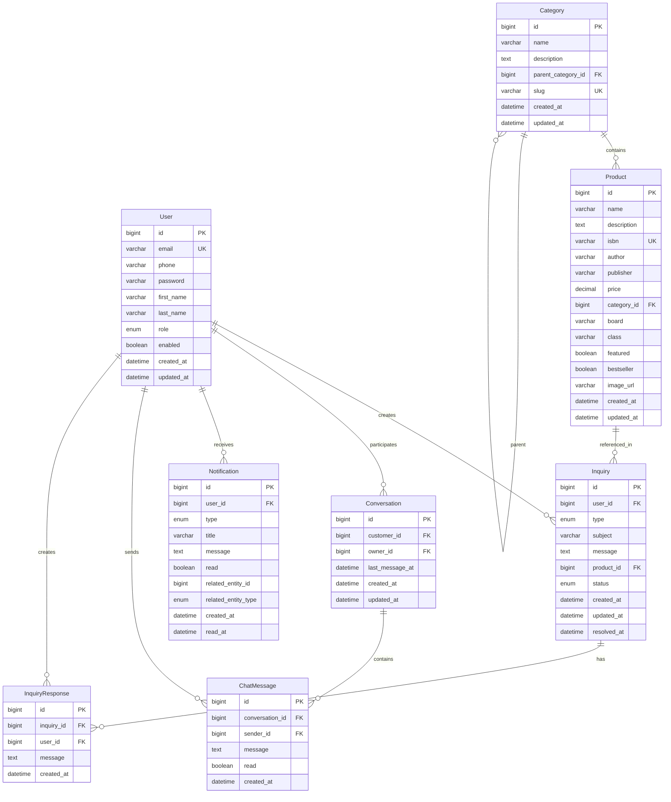

# Database Schema Documentation

## Overview

This document describes the complete database schema for the Vidyarthi Book Depot platform. The database uses MySQL 8.0+ with InnoDB storage engine and UTF-8 character set.

## Database Configuration

- **Database Name**: `vidyarthi_book_depot`
- **Character Set**: `utf8mb4`
- **Collation**: `utf8mb4_unicode_ci`
- **Storage Engine**: `InnoDB`
- **Time Zone**: `UTC`

## Entity Relationship Diagram



## Table Definitions

### 1. users

**Description**: Stores user account information

**Columns**:

| Column Name | Data Type | Constraints | Description |
|------------|-----------|-------------|-------------|
| id | BIGINT | PRIMARY KEY, AUTO_INCREMENT | User ID |
| email | VARCHAR(255) | UNIQUE, NOT NULL | User email address |
| phone | VARCHAR(20) | NULL | Phone number |
| password | VARCHAR(255) | NOT NULL | Encrypted password (BCrypt) |
| first_name | VARCHAR(100) | NULL | First name |
| last_name | VARCHAR(100) | NULL | Last name |
| role | ENUM('CUSTOMER', 'OWNER', 'ADMIN') | NOT NULL, DEFAULT 'CUSTOMER' | User role |
| enabled | BOOLEAN | NOT NULL, DEFAULT TRUE | Account enabled status |
| created_at | DATETIME | NOT NULL | Creation timestamp |
| updated_at | DATETIME | NOT NULL | Last update timestamp |

**Indexes**:
- PRIMARY KEY (id)
- UNIQUE KEY (email)
- INDEX (role)
- INDEX (enabled)

**Sample Data**:
```sql
INSERT INTO users (email, phone, password, first_name, last_name, role, enabled) 
VALUES 
('owner@vbd.com', '+919876543210', '$2a$10$...', 'Store', 'Owner', 'OWNER', TRUE),
('customer@example.com', '+919876543211', '$2a$10$...', 'John', 'Doe', 'CUSTOMER', TRUE);
```

### 2. products

**Description**: Stores product/book information

**Columns**:

| Column Name | Data Type | Constraints | Description |
|------------|-----------|-------------|-------------|
| id | BIGINT | PRIMARY KEY, AUTO_INCREMENT | Product ID |
| name | VARCHAR(255) | NOT NULL | Product name |
| description | TEXT | NULL | Product description |
| isbn | VARCHAR(50) | UNIQUE | ISBN number |
| author | VARCHAR(255) | NULL | Author name |
| publisher | VARCHAR(255) | NULL | Publisher name |
| price | DECIMAL(10,2) | NOT NULL | Product price |
| category_id | BIGINT | FOREIGN KEY | Category ID |
| board | VARCHAR(50) | NULL | Educational board (SSC, HSC, ICSE, CBSE) |
| class | VARCHAR(50) | NULL | Class/grade |
| featured | BOOLEAN | NOT NULL, DEFAULT FALSE | Featured product flag |
| bestseller | BOOLEAN | NOT NULL, DEFAULT FALSE | Bestseller flag |
| image_url | VARCHAR(500) | NULL | Product image URL |
| created_at | DATETIME | NOT NULL | Creation timestamp |
| updated_at | DATETIME | NOT NULL | Last update timestamp |

**Indexes**:
- PRIMARY KEY (id)
- UNIQUE KEY (isbn)
- INDEX (category_id)
- INDEX (board)
- INDEX (class)
- INDEX (featured)
- INDEX (bestseller)
- FULLTEXT INDEX (name, description) -- For search

**Foreign Keys**:
- FOREIGN KEY (category_id) REFERENCES categories(id) ON DELETE SET NULL

**Sample Data**:
```sql
INSERT INTO products (name, description, isbn, author, publisher, price, category_id, board, class, featured) 
VALUES 
('Mathematics for Class 10', 'Comprehensive mathematics textbook', '978-1234567890', 'Dr. Ramesh Kumar', 'Educational Publishers', 450.00, 1, 'SSC', '10', TRUE);
```

### 3. categories

**Description**: Stores product categories with hierarchical structure

**Columns**:

| Column Name | Data Type | Constraints | Description |
|------------|-----------|-------------|-------------|
| id | BIGINT | PRIMARY KEY, AUTO_INCREMENT | Category ID |
| name | VARCHAR(255) | NOT NULL | Category name |
| description | TEXT | NULL | Category description |
| parent_category_id | BIGINT | FOREIGN KEY, NULL | Parent category ID |
| slug | VARCHAR(255) | UNIQUE | URL-friendly slug |
| created_at | DATETIME | NOT NULL | Creation timestamp |
| updated_at | DATETIME | NOT NULL | Last update timestamp |

**Indexes**:
- PRIMARY KEY (id)
- UNIQUE KEY (slug)
- INDEX (parent_category_id)

**Foreign Keys**:
- FOREIGN KEY (parent_category_id) REFERENCES categories(id) ON DELETE CASCADE

**Sample Data**:
```sql
INSERT INTO categories (name, description, parent_category_id, slug) 
VALUES 
('School Books', 'Textbooks for school students', NULL, 'school-books'),
('SSC', 'State Board books', 1, 'school-books-ssc'),
('HSC', 'Higher Secondary books', 1, 'school-books-hsc');
```

### 4. inquiries

**Description**: Stores customer inquiries

**Columns**:

| Column Name | Data Type | Constraints | Description |
|------------|-----------|-------------|-------------|
| id | BIGINT | PRIMARY KEY, AUTO_INCREMENT | Inquiry ID |
| user_id | BIGINT | FOREIGN KEY, NOT NULL | User ID (customer) |
| type | ENUM('BOOK_AVAILABILITY', 'GENERAL_QUESTION', 'CUSTOM_ORDER') | NOT NULL | Inquiry type |
| subject | VARCHAR(200) | NOT NULL | Inquiry subject |
| message | TEXT | NOT NULL | Inquiry message |
| product_id | BIGINT | FOREIGN KEY, NULL | Related product ID |
| status | ENUM('PENDING', 'IN_PROGRESS', 'RESOLVED', 'CLOSED') | NOT NULL, DEFAULT 'PENDING' | Inquiry status |
| created_at | DATETIME | NOT NULL | Creation timestamp |
| updated_at | DATETIME | NOT NULL | Last update timestamp |
| resolved_at | DATETIME | NULL | Resolution timestamp |

**Indexes**:
- PRIMARY KEY (id)
- INDEX (user_id)
- INDEX (product_id)
- INDEX (status)
- INDEX (type)
- INDEX (created_at)

**Foreign Keys**:
- FOREIGN KEY (user_id) REFERENCES users(id) ON DELETE CASCADE
- FOREIGN KEY (product_id) REFERENCES products(id) ON DELETE SET NULL

**Sample Data**:
```sql
INSERT INTO inquiries (user_id, type, subject, message, product_id, status) 
VALUES 
(2, 'BOOK_AVAILABILITY', 'Availability of Mathematics Class 10', 'Do you have this book in stock?', 1, 'PENDING');
```

### 5. inquiry_responses

**Description**: Stores owner responses to inquiries

**Columns**:

| Column Name | Data Type | Constraints | Description |
|------------|-----------|-------------|-------------|
| id | BIGINT | PRIMARY KEY, AUTO_INCREMENT | Response ID |
| inquiry_id | BIGINT | FOREIGN KEY, NOT NULL | Inquiry ID |
| user_id | BIGINT | FOREIGN KEY, NOT NULL | User ID (owner) |
| message | TEXT | NOT NULL | Response message |
| created_at | DATETIME | NOT NULL | Creation timestamp |

**Indexes**:
- PRIMARY KEY (id)
- INDEX (inquiry_id)
- INDEX (user_id)
- INDEX (created_at)

**Foreign Keys**:
- FOREIGN KEY (inquiry_id) REFERENCES inquiries(id) ON DELETE CASCADE
- FOREIGN KEY (user_id) REFERENCES users(id) ON DELETE CASCADE

**Sample Data**:
```sql
INSERT INTO inquiry_responses (inquiry_id, user_id, message) 
VALUES 
(1, 1, 'Yes, we have this book in stock. You can visit our store.');
```

### 6. conversations

**Description**: Stores chat conversations between customers and owner

**Columns**:

| Column Name | Data Type | Constraints | Description |
|------------|-----------|-------------|-------------|
| id | BIGINT | PRIMARY KEY, AUTO_INCREMENT | Conversation ID |
| customer_id | BIGINT | FOREIGN KEY, NOT NULL | Customer user ID |
| owner_id | BIGINT | FOREIGN KEY, NOT NULL | Owner user ID |
| last_message_at | DATETIME | NULL | Last message timestamp |
| created_at | DATETIME | NOT NULL | Creation timestamp |
| updated_at | DATETIME | NOT NULL | Last update timestamp |

**Indexes**:
- PRIMARY KEY (id)
- UNIQUE KEY (customer_id, owner_id) -- One conversation per customer-owner pair
- INDEX (customer_id)
- INDEX (owner_id)
- INDEX (last_message_at)

**Foreign Keys**:
- FOREIGN KEY (customer_id) REFERENCES users(id) ON DELETE CASCADE
- FOREIGN KEY (owner_id) REFERENCES users(id) ON DELETE CASCADE

**Sample Data**:
```sql
INSERT INTO conversations (customer_id, owner_id, last_message_at) 
VALUES 
(2, 1, '2025-12-23 10:00:00');
```

### 7. chat_messages

**Description**: Stores chat messages

**Columns**:

| Column Name | Data Type | Constraints | Description |
|------------|-----------|-------------|-------------|
| id | BIGINT | PRIMARY KEY, AUTO_INCREMENT | Message ID |
| conversation_id | BIGINT | FOREIGN KEY, NOT NULL | Conversation ID |
| sender_id | BIGINT | FOREIGN KEY, NOT NULL | Sender user ID |
| message | TEXT | NOT NULL | Message content |
| read | BOOLEAN | NOT NULL, DEFAULT FALSE | Read status |
| created_at | DATETIME | NOT NULL | Creation timestamp |

**Indexes**:
- PRIMARY KEY (id)
- INDEX (conversation_id)
- INDEX (sender_id)
- INDEX (conversation_id, created_at) -- For message ordering
- INDEX (conversation_id, read) -- For unread count

**Foreign Keys**:
- FOREIGN KEY (conversation_id) REFERENCES conversations(id) ON DELETE CASCADE
- FOREIGN KEY (sender_id) REFERENCES users(id) ON DELETE CASCADE

**Sample Data**:
```sql
INSERT INTO chat_messages (conversation_id, sender_id, message, read) 
VALUES 
(1, 2, 'Hello, do you have Mathematics Class 10?', FALSE),
(1, 1, 'Yes, we have it in stock.', TRUE);
```

### 8. notifications

**Description**: Stores in-app notifications

**Columns**:

| Column Name | Data Type | Constraints | Description |
|------------|-----------|-------------|-------------|
| id | BIGINT | PRIMARY KEY, AUTO_INCREMENT | Notification ID |
| user_id | BIGINT | FOREIGN KEY, NOT NULL | User ID |
| type | ENUM('INQUIRY_RESPONSE', 'CHAT_MESSAGE', 'INQUIRY_CREATED', 'SYSTEM') | NOT NULL | Notification type |
| title | VARCHAR(255) | NOT NULL | Notification title |
| message | TEXT | NOT NULL | Notification message |
| read | BOOLEAN | NOT NULL, DEFAULT FALSE | Read status |
| related_entity_id | BIGINT | NULL | Related entity ID |
| related_entity_type | ENUM('INQUIRY', 'CONVERSATION', 'PRODUCT', 'USER') | NULL | Related entity type |
| created_at | DATETIME | NOT NULL | Creation timestamp |
| read_at | DATETIME | NULL | Read timestamp |

**Indexes**:
- PRIMARY KEY (id)
- INDEX (user_id)
- INDEX (type)
- INDEX (read)
- INDEX (user_id, read, created_at) -- For notification queries
- INDEX (user_id, type) -- For type-based queries

**Foreign Keys**:
- FOREIGN KEY (user_id) REFERENCES users(id) ON DELETE CASCADE

**Sample Data**:
```sql
INSERT INTO notifications (user_id, type, title, message, related_entity_id, related_entity_type) 
VALUES 
(2, 'INQUIRY_RESPONSE', 'Response to your inquiry', 'Store owner has responded to your inquiry', 1, 'INQUIRY');
```

## Database Initialization Script

### Schema Creation

```sql
-- Create database
CREATE DATABASE IF NOT EXISTS vidyarthi_book_depot
CHARACTER SET utf8mb4
COLLATE utf8mb4_unicode_ci;

USE vidyarthi_book_depot;

-- Create users table
CREATE TABLE users (
    id BIGINT AUTO_INCREMENT PRIMARY KEY,
    email VARCHAR(255) UNIQUE NOT NULL,
    phone VARCHAR(20),
    password VARCHAR(255) NOT NULL,
    first_name VARCHAR(100),
    last_name VARCHAR(100),
    role ENUM('CUSTOMER', 'OWNER', 'ADMIN') NOT NULL DEFAULT 'CUSTOMER',
    enabled BOOLEAN NOT NULL DEFAULT TRUE,
    created_at DATETIME NOT NULL DEFAULT CURRENT_TIMESTAMP,
    updated_at DATETIME NOT NULL DEFAULT CURRENT_TIMESTAMP ON UPDATE CURRENT_TIMESTAMP,
    INDEX idx_role (role),
    INDEX idx_enabled (enabled)
) ENGINE=InnoDB DEFAULT CHARSET=utf8mb4 COLLATE=utf8mb4_unicode_ci;

-- Create categories table
CREATE TABLE categories (
    id BIGINT AUTO_INCREMENT PRIMARY KEY,
    name VARCHAR(255) NOT NULL,
    description TEXT,
    parent_category_id BIGINT,
    slug VARCHAR(255) UNIQUE NOT NULL,
    created_at DATETIME NOT NULL DEFAULT CURRENT_TIMESTAMP,
    updated_at DATETIME NOT NULL DEFAULT CURRENT_TIMESTAMP ON UPDATE CURRENT_TIMESTAMP,
    INDEX idx_parent (parent_category_id),
    FOREIGN KEY (parent_category_id) REFERENCES categories(id) ON DELETE CASCADE
) ENGINE=InnoDB DEFAULT CHARSET=utf8mb4 COLLATE=utf8mb4_unicode_ci;

-- Create products table
CREATE TABLE products (
    id BIGINT AUTO_INCREMENT PRIMARY KEY,
    name VARCHAR(255) NOT NULL,
    description TEXT,
    isbn VARCHAR(50) UNIQUE,
    author VARCHAR(255),
    publisher VARCHAR(255),
    price DECIMAL(10,2) NOT NULL,
    category_id BIGINT,
    board VARCHAR(50),
    class VARCHAR(50),
    featured BOOLEAN NOT NULL DEFAULT FALSE,
    bestseller BOOLEAN NOT NULL DEFAULT FALSE,
    image_url VARCHAR(500),
    created_at DATETIME NOT NULL DEFAULT CURRENT_TIMESTAMP,
    updated_at DATETIME NOT NULL DEFAULT CURRENT_TIMESTAMP ON UPDATE CURRENT_TIMESTAMP,
    INDEX idx_category (category_id),
    INDEX idx_board (board),
    INDEX idx_class (class),
    INDEX idx_featured (featured),
    INDEX idx_bestseller (bestseller),
    FULLTEXT INDEX idx_search (name, description),
    FOREIGN KEY (category_id) REFERENCES categories(id) ON DELETE SET NULL
) ENGINE=InnoDB DEFAULT CHARSET=utf8mb4 COLLATE=utf8mb4_unicode_ci;

-- Create inquiries table
CREATE TABLE inquiries (
    id BIGINT AUTO_INCREMENT PRIMARY KEY,
    user_id BIGINT NOT NULL,
    type ENUM('BOOK_AVAILABILITY', 'GENERAL_QUESTION', 'CUSTOM_ORDER') NOT NULL,
    subject VARCHAR(200) NOT NULL,
    message TEXT NOT NULL,
    product_id BIGINT,
    status ENUM('PENDING', 'IN_PROGRESS', 'RESOLVED', 'CLOSED') NOT NULL DEFAULT 'PENDING',
    created_at DATETIME NOT NULL DEFAULT CURRENT_TIMESTAMP,
    updated_at DATETIME NOT NULL DEFAULT CURRENT_TIMESTAMP ON UPDATE CURRENT_TIMESTAMP,
    resolved_at DATETIME,
    INDEX idx_user (user_id),
    INDEX idx_product (product_id),
    INDEX idx_status (status),
    INDEX idx_type (type),
    INDEX idx_created (created_at),
    FOREIGN KEY (user_id) REFERENCES users(id) ON DELETE CASCADE,
    FOREIGN KEY (product_id) REFERENCES products(id) ON DELETE SET NULL
) ENGINE=InnoDB DEFAULT CHARSET=utf8mb4 COLLATE=utf8mb4_unicode_ci;

-- Create inquiry_responses table
CREATE TABLE inquiry_responses (
    id BIGINT AUTO_INCREMENT PRIMARY KEY,
    inquiry_id BIGINT NOT NULL,
    user_id BIGINT NOT NULL,
    message TEXT NOT NULL,
    created_at DATETIME NOT NULL DEFAULT CURRENT_TIMESTAMP,
    INDEX idx_inquiry (inquiry_id),
    INDEX idx_user (user_id),
    INDEX idx_created (created_at),
    FOREIGN KEY (inquiry_id) REFERENCES inquiries(id) ON DELETE CASCADE,
    FOREIGN KEY (user_id) REFERENCES users(id) ON DELETE CASCADE
) ENGINE=InnoDB DEFAULT CHARSET=utf8mb4 COLLATE=utf8mb4_unicode_ci;

-- Create conversations table
CREATE TABLE conversations (
    id BIGINT AUTO_INCREMENT PRIMARY KEY,
    customer_id BIGINT NOT NULL,
    owner_id BIGINT NOT NULL,
    last_message_at DATETIME,
    created_at DATETIME NOT NULL DEFAULT CURRENT_TIMESTAMP,
    updated_at DATETIME NOT NULL DEFAULT CURRENT_TIMESTAMP ON UPDATE CURRENT_TIMESTAMP,
    UNIQUE KEY uk_customer_owner (customer_id, owner_id),
    INDEX idx_customer (customer_id),
    INDEX idx_owner (owner_id),
    INDEX idx_last_message (last_message_at),
    FOREIGN KEY (customer_id) REFERENCES users(id) ON DELETE CASCADE,
    FOREIGN KEY (owner_id) REFERENCES users(id) ON DELETE CASCADE
) ENGINE=InnoDB DEFAULT CHARSET=utf8mb4 COLLATE=utf8mb4_unicode_ci;

-- Create chat_messages table
CREATE TABLE chat_messages (
    id BIGINT AUTO_INCREMENT PRIMARY KEY,
    conversation_id BIGINT NOT NULL,
    sender_id BIGINT NOT NULL,
    message TEXT NOT NULL,
    read BOOLEAN NOT NULL DEFAULT FALSE,
    created_at DATETIME NOT NULL DEFAULT CURRENT_TIMESTAMP,
    INDEX idx_conversation (conversation_id),
    INDEX idx_sender (sender_id),
    INDEX idx_conversation_created (conversation_id, created_at),
    INDEX idx_conversation_read (conversation_id, read),
    FOREIGN KEY (conversation_id) REFERENCES conversations(id) ON DELETE CASCADE,
    FOREIGN KEY (sender_id) REFERENCES users(id) ON DELETE CASCADE
) ENGINE=InnoDB DEFAULT CHARSET=utf8mb4 COLLATE=utf8mb4_unicode_ci;

-- Create notifications table
CREATE TABLE notifications (
    id BIGINT AUTO_INCREMENT PRIMARY KEY,
    user_id BIGINT NOT NULL,
    type ENUM('INQUIRY_RESPONSE', 'CHAT_MESSAGE', 'INQUIRY_CREATED', 'SYSTEM') NOT NULL,
    title VARCHAR(255) NOT NULL,
    message TEXT NOT NULL,
    read BOOLEAN NOT NULL DEFAULT FALSE,
    related_entity_id BIGINT,
    related_entity_type ENUM('INQUIRY', 'CONVERSATION', 'PRODUCT', 'USER'),
    created_at DATETIME NOT NULL DEFAULT CURRENT_TIMESTAMP,
    read_at DATETIME,
    INDEX idx_user (user_id),
    INDEX idx_type (type),
    INDEX idx_read (read),
    INDEX idx_user_read_created (user_id, read, created_at),
    INDEX idx_user_type (user_id, type),
    FOREIGN KEY (user_id) REFERENCES users(id) ON DELETE CASCADE
) ENGINE=InnoDB DEFAULT CHARSET=utf8mb4 COLLATE=utf8mb4_unicode_ci;
```

## Migration Strategy

### Using Flyway or Liquibase

The database schema should be managed using migration tools:

1. **Initial Migration**: Create all tables
2. **Version Control**: Track schema changes
3. **Rollback Support**: Ability to rollback changes
4. **Data Migrations**: Handle data transformations

## Performance Optimization

### Indexing Strategy

- **Primary Keys**: All tables have auto-increment primary keys
- **Foreign Keys**: Indexed for join performance
- **Query Patterns**: Indexes based on common query patterns
- **Composite Indexes**: For multi-column queries

### Query Optimization

- **JOIN Optimization**: Proper foreign key relationships
- **Pagination**: All list queries support pagination
- **Full-Text Search**: Full-text indexes for product search
- **Covering Indexes**: Indexes that cover query requirements

## Backup and Recovery

### Backup Strategy

- **Daily Backups**: Full database backup
- **Transaction Logs**: Continuous transaction log backup
- **Point-in-Time Recovery**: Ability to recover to specific time

### Recovery Procedures

1. Restore from latest backup
2. Apply transaction logs
3. Verify data integrity
4. Resume operations

## Data Retention

### Retention Policies

- **Active Data**: No automatic deletion
- **Archived Data**: Archive old inquiries after 1 year
- **Notifications**: Delete read notifications after 90 days
- **Chat Messages**: Retain all messages

## Security Considerations

1. **User Permissions**: Database user with minimal required permissions
2. **SQL Injection**: Use parameterized queries (JPA handles this)
3. **Data Encryption**: Sensitive data encrypted at application level
4. **Backup Encryption**: Encrypted backups
5. **Access Control**: Database access restricted to application servers

