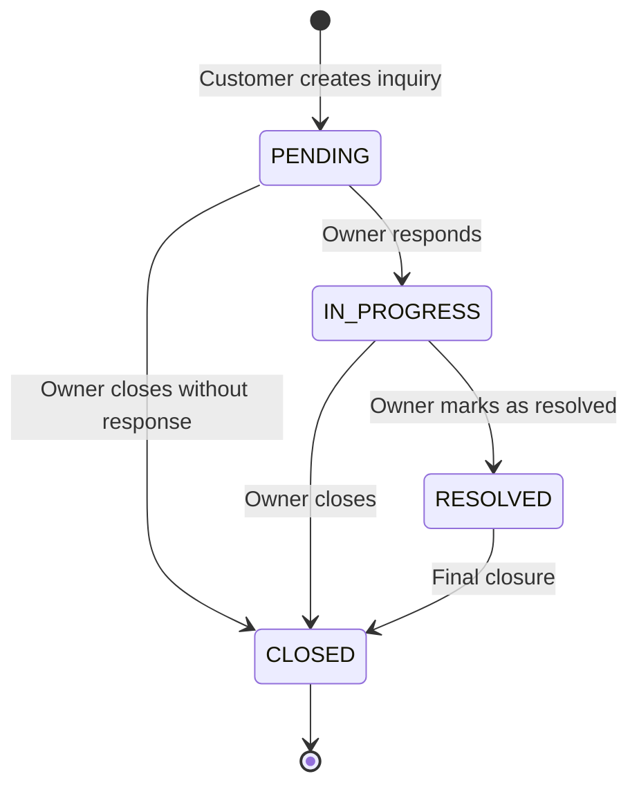
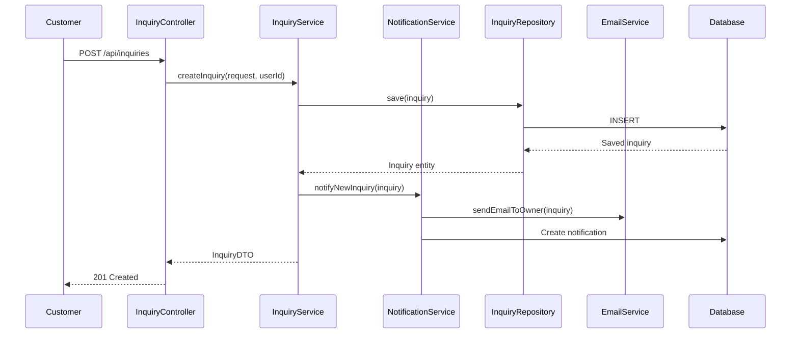
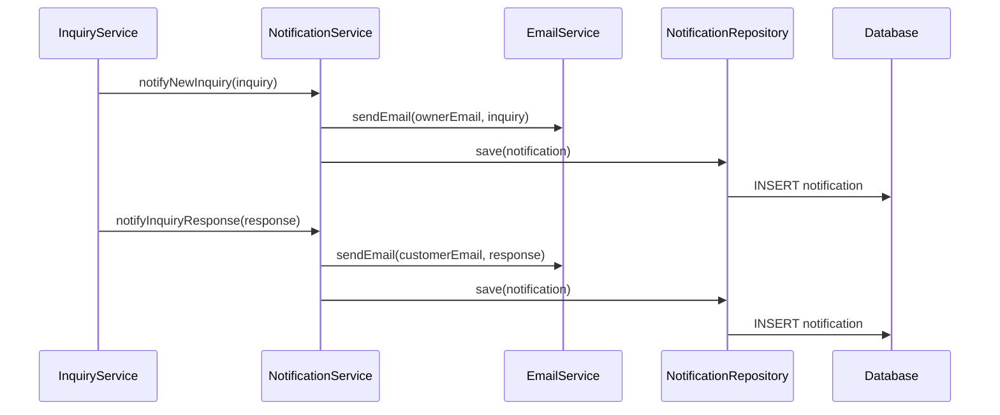
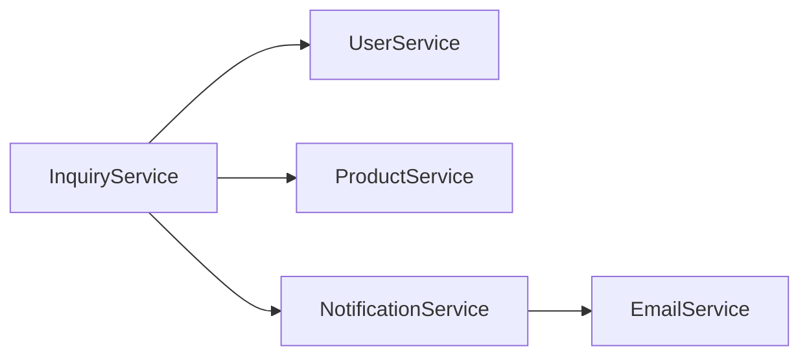

# Inquiry Service Documentation

## Overview

The Inquiry Service handles customer inquiries about books, availability, pricing, and custom orders. It manages the complete inquiry lifecycle from creation to resolution, including owner responses and status tracking.

## Service Responsibilities

- Inquiry creation and management
- Inquiry status tracking
- Owner response handling
- Inquiry filtering and search
- Inquiry statistics and reporting
- Email notifications for inquiries

## API Endpoints

### 1. Create Inquiry

**Endpoint**: `POST /api/inquiries`

**Description**: Create a new inquiry

**Headers**: `Authorization: Bearer {token}`

**Request Body**:
```json
{
  "type": "BOOK_AVAILABILITY",
  "subject": "Availability of Mathematics Class 10",
  "message": "Do you have Mathematics for Class 10 by Dr. Ramesh Kumar in stock?",
  "productId": 1
}
```

**Response**: `201 Created`
```json
{
  "id": 1,
  "type": "BOOK_AVAILABILITY",
  "subject": "Availability of Mathematics Class 10",
  "message": "Do you have Mathematics for Class 10 by Dr. Ramesh Kumar in stock?",
  "productId": 1,
  "productName": "Mathematics for Class 10",
  "status": "PENDING",
  "userId": 5,
  "userName": "John Doe",
  "createdAt": "2025-12-23T10:00:00Z",
  "responses": []
}
```

**Authorization**: Requires authentication (CUSTOMER)

**Inquiry Types**:
- `BOOK_AVAILABILITY`: Inquiry about book availability
- `GENERAL_QUESTION`: General questions about products/services
- `CUSTOM_ORDER`: Request for custom book orders

**Validation Rules**:
- Subject is required (max 200 characters)
- Message is required (max 2000 characters)
- Type must be valid enum value
- ProductId is optional (required for BOOK_AVAILABILITY)

### 2. List Inquiries

**Endpoint**: `GET /api/inquiries`

**Description**: Get paginated list of inquiries (filtered by user role)

**Headers**: `Authorization: Bearer {token}`

**Query Parameters**:
- `page` (int, default: 0): Page number
- `size` (int, default: 20): Page size
- `status` (String, optional): Filter by status (PENDING, IN_PROGRESS, RESOLVED, CLOSED)
- `type` (String, optional): Filter by type
- `productId` (Long, optional): Filter by product

**Response**: `200 OK`
```json
{
  "content": [
    {
      "id": 1,
      "type": "BOOK_AVAILABILITY",
      "subject": "Availability of Mathematics Class 10",
      "status": "PENDING",
      "productName": "Mathematics for Class 10",
      "userName": "John Doe",
      "createdAt": "2025-12-23T10:00:00Z",
      "hasResponse": false
    }
  ],
  "page": 0,
  "size": 20,
  "totalElements": 50,
  "totalPages": 3
}
```

**Authorization**: 
- CUSTOMER: Only their own inquiries
- OWNER: All inquiries

### 3. Get Inquiry Details

**Endpoint**: `GET /api/inquiries/{id}`

**Description**: Get detailed information about a specific inquiry

**Headers**: `Authorization: Bearer {token}`

**Path Parameters**:
- `id` (Long): Inquiry ID

**Response**: `200 OK`
```json
{
  "id": 1,
  "type": "BOOK_AVAILABILITY",
  "subject": "Availability of Mathematics Class 10",
  "message": "Do you have Mathematics for Class 10 by Dr. Ramesh Kumar in stock?",
  "productId": 1,
  "productName": "Mathematics for Class 10",
  "status": "IN_PROGRESS",
  "userId": 5,
  "userName": "John Doe",
  "userEmail": "john@example.com",
  "createdAt": "2025-12-23T10:00:00Z",
  "updatedAt": "2025-12-23T11:00:00Z",
  "resolvedAt": null,
  "responses": [
    {
      "id": 1,
      "message": "Yes, we have this book in stock. You can visit our store or we can arrange delivery.",
      "userId": 1,
      "userName": "Store Owner",
      "createdAt": "2025-12-23T11:00:00Z"
    }
  ]
}
```

**Authorization**: 
- CUSTOMER: Only their own inquiries
- OWNER: All inquiries

**Error Responses**:
- `404 Not Found`: Inquiry not found
- `403 Forbidden`: Not authorized to view this inquiry

### 4. Update Inquiry Status

**Endpoint**: `PUT /api/inquiries/{id}/status`

**Description**: Update inquiry status (owner only)

**Headers**: `Authorization: Bearer {token}`

**Path Parameters**:
- `id` (Long): Inquiry ID

**Request Body**:
```json
{
  "status": "RESOLVED"
}
```

**Response**: `200 OK`
```json
{
  "id": 1,
  "status": "RESOLVED",
  "resolvedAt": "2025-12-23T12:00:00Z",
  "updatedAt": "2025-12-23T12:00:00Z"
}
```

**Authorization**: OWNER only

**Valid Status Transitions**:
- PENDING → IN_PROGRESS, CLOSED
- IN_PROGRESS → RESOLVED, CLOSED
- RESOLVED → CLOSED
- CLOSED → (final state)

### 5. Add Response to Inquiry

**Endpoint**: `POST /api/inquiries/{id}/response`

**Description**: Add owner response to an inquiry

**Headers**: `Authorization: Bearer {token}`

**Path Parameters**:
- `id` (Long): Inquiry ID

**Request Body**:
```json
{
  "message": "Yes, we have this book in stock. You can visit our store or we can arrange delivery."
}
```

**Response**: `201 Created`
```json
{
  "id": 2,
  "inquiryId": 1,
  "message": "Yes, we have this book in stock. You can visit our store or we can arrange delivery.",
  "userId": 1,
  "userName": "Store Owner",
  "createdAt": "2025-12-23T11:00:00Z"
}
```

**Authorization**: OWNER only

**Business Rules**:
- Automatically sets inquiry status to IN_PROGRESS if PENDING
- Sends email notification to customer
- Creates in-app notification

### 6. Get My Inquiries

**Endpoint**: `GET /api/inquiries/my-inquiries`

**Description**: Get current user's inquiries

**Headers**: `Authorization: Bearer {token}`

**Query Parameters**:
- `page` (int, default: 0): Page number
- `size` (int, default: 20): Page size
- `status` (String, optional): Filter by status

**Response**: `200 OK` (Same structure as List Inquiries)

**Authorization**: Requires authentication

### 7. Get Pending Inquiries

**Endpoint**: `GET /api/inquiries/pending`

**Description**: Get all pending inquiries (owner only)

**Headers**: `Authorization: Bearer {token}`

**Query Parameters**:
- `page` (int, default: 0): Page number
- `size` (int, default: 20): Page size

**Response**: `200 OK` (Same structure as List Inquiries)

**Authorization**: OWNER only

### 8. Get Inquiry Statistics

**Endpoint**: `GET /api/inquiries/statistics`

**Description**: Get inquiry statistics (owner only)

**Headers**: `Authorization: Bearer {token}`

**Query Parameters**:
- `period` (String, optional): Time period (TODAY, WEEK, MONTH, YEAR)

**Response**: `200 OK`
```json
{
  "total": 150,
  "pending": 25,
  "inProgress": 10,
  "resolved": 100,
  "closed": 15,
  "byType": {
    "BOOK_AVAILABILITY": 80,
    "GENERAL_QUESTION": 50,
    "CUSTOM_ORDER": 20
  },
  "averageResponseTime": "2.5 hours",
  "period": "MONTH"
}
```

**Authorization**: OWNER only

### 9. Update Inquiry

**Endpoint**: `PUT /api/inquiries/{id}`

**Description**: Update inquiry (customer can update their own, owner can update any)

**Headers**: `Authorization: Bearer {token}`

**Path Parameters**:
- `id` (Long): Inquiry ID

**Request Body**:
```json
{
  "subject": "Updated subject",
  "message": "Updated message"
}
```

**Response**: `200 OK` (Updated inquiry)

**Authorization**: 
- CUSTOMER: Only their own inquiries (only if PENDING)
- OWNER: Any inquiry

**Business Rules**:
- Customers can only update PENDING inquiries
- Owner can update any inquiry

### 10. Delete Inquiry

**Endpoint**: `DELETE /api/inquiries/{id}`

**Description**: Delete an inquiry

**Headers**: `Authorization: Bearer {token}`

**Path Parameters**:
- `id` (Long): Inquiry ID

**Response**: `204 No Content`

**Authorization**: 
- CUSTOMER: Only their own inquiries (only if PENDING)
- OWNER: Any inquiry

**Business Rules**:
- Customers can only delete PENDING inquiries
- Owner can delete any inquiry

## Inquiry Lifecycle



## Service Flow



## Inquiry Entity

```java
@Entity
@Table(name = "inquiries")
public class Inquiry {
    @Id
    @GeneratedValue(strategy = GenerationType.IDENTITY)
    private Long id;
    
    @ManyToOne
    @JoinColumn(name = "user_id", nullable = false)
    private User user;
    
    @Enumerated(EnumType.STRING)
    @Column(nullable = false)
    private InquiryType type;
    
    @Column(nullable = false, length = 200)
    private String subject;
    
    @Column(nullable = false, columnDefinition = "TEXT")
    private String message;
    
    @ManyToOne
    @JoinColumn(name = "product_id")
    private Product product;
    
    @Enumerated(EnumType.STRING)
    @Column(nullable = false)
    private InquiryStatus status;
    
    @OneToMany(mappedBy = "inquiry", cascade = CascadeType.ALL)
    private List<InquiryResponse> responses;
    
    @CreationTimestamp
    private LocalDateTime createdAt;
    
    @UpdateTimestamp
    private LocalDateTime updatedAt;
    
    private LocalDateTime resolvedAt;
}
```

## Inquiry Types

```java
public enum InquiryType {
    BOOK_AVAILABILITY,    // Inquiry about book availability
    GENERAL_QUESTION,      // General questions
    CUSTOM_ORDER          // Custom book orders
}
```

## Inquiry Status

```java
public enum InquiryStatus {
    PENDING,        // Newly created, awaiting response
    IN_PROGRESS,    // Owner has responded, in progress
    RESOLVED,       // Inquiry resolved
    CLOSED          // Inquiry closed
}
```

## Inquiry Response Entity

```java
@Entity
@Table(name = "inquiry_responses")
public class InquiryResponse {
    @Id
    @GeneratedValue(strategy = GenerationType.IDENTITY)
    private Long id;
    
    @ManyToOne
    @JoinColumn(name = "inquiry_id", nullable = false)
    private Inquiry inquiry;
    
    @ManyToOne
    @JoinColumn(name = "user_id", nullable = false)
    private User user;
    
    @Column(nullable = false, columnDefinition = "TEXT")
    private String message;
    
    @CreationTimestamp
    private LocalDateTime createdAt;
}
```

## Service Methods

### InquiryService Interface

```java
public interface InquiryService {
    InquiryDTO createInquiry(CreateInquiryRequest request, Long userId);
    Page<InquiryDTO> getInquiries(InquiryFilter filter, Pageable pageable, User currentUser);
    InquiryDTO getInquiryById(Long id, User currentUser);
    InquiryDTO updateInquiryStatus(Long id, InquiryStatus status);
    InquiryResponseDTO addResponse(Long inquiryId, String message, Long userId);
    Page<InquiryDTO> getMyInquiries(Long userId, InquiryFilter filter, Pageable pageable);
    Page<InquiryDTO> getPendingInquiries(Pageable pageable);
    InquiryStatisticsDTO getStatistics(String period);
    InquiryDTO updateInquiry(Long id, UpdateInquiryRequest request, User currentUser);
    void deleteInquiry(Long id, User currentUser);
}
```

## Notification Flow



## Database Queries

### Optimized Queries

**Get Inquiries with Filters**:
```sql
SELECT 
    i.id,
    i.type,
    i.subject,
    i.status,
    i.created_at,
    u.first_name || ' ' || u.last_name as user_name,
    p.name as product_name
FROM inquiries i
INNER JOIN users u ON i.user_id = u.id
LEFT JOIN products p ON i.product_id = p.id
WHERE 
    (:status IS NULL OR i.status = :status)
    AND (:type IS NULL OR i.type = :type)
    AND (:productId IS NULL OR i.product_id = :productId)
    AND (:userId IS NULL OR i.user_id = :userId)
ORDER BY i.created_at DESC
LIMIT :size OFFSET :offset
```

## Performance Considerations

### Indexing

- **Primary Key**: id (auto-indexed)
- **Indexes**: userId, productId, status, type, createdAt
- **Composite Index**: (userId, status) for user inquiry queries
- **Composite Index**: (status, createdAt) for pending inquiries

### Caching

- **Statistics Cache**: Cache inquiry statistics (5-minute TTL)
- **User Inquiry Cache**: Cache user's recent inquiries

## Error Handling

### Custom Exceptions

- **InquiryNotFoundException**: When inquiry is not found
- **UnauthorizedInquiryAccessException**: When user tries to access unauthorized inquiry
- **InvalidInquiryStatusException**: When status transition is invalid
- **InquiryUpdateNotAllowedException**: When inquiry cannot be updated

## Integration with Other Services



- Inquiry Service validates user and product existence
- Notification Service handles email and in-app notifications
- Product Service provides product details for inquiries

## Testing Considerations

### Unit Tests
- Inquiry creation with valid/invalid data
- Status transition validation
- Authorization checks
- Response creation

### Integration Tests
- Complete inquiry lifecycle
- Notification triggering
- Email sending
- Statistics calculation

## Business Rules

1. **Inquiry Creation**: Only authenticated customers can create inquiries
2. **Status Transitions**: Only valid status transitions allowed
3. **Response**: Only owner can respond to inquiries
4. **Update**: Customers can only update PENDING inquiries
5. **Delete**: Customers can only delete PENDING inquiries
6. **Notifications**: Email sent on new inquiry and response

## Future Enhancements

- Inquiry priority levels
- Inquiry assignment to staff
- Inquiry templates
- Bulk inquiry operations
- Inquiry analytics dashboard
- Customer inquiry history
- Inquiry search functionality

