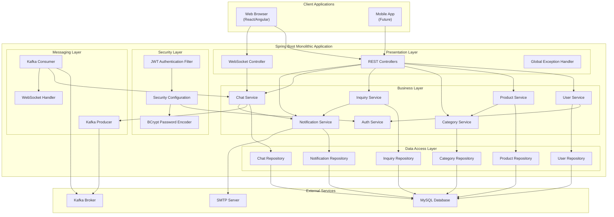
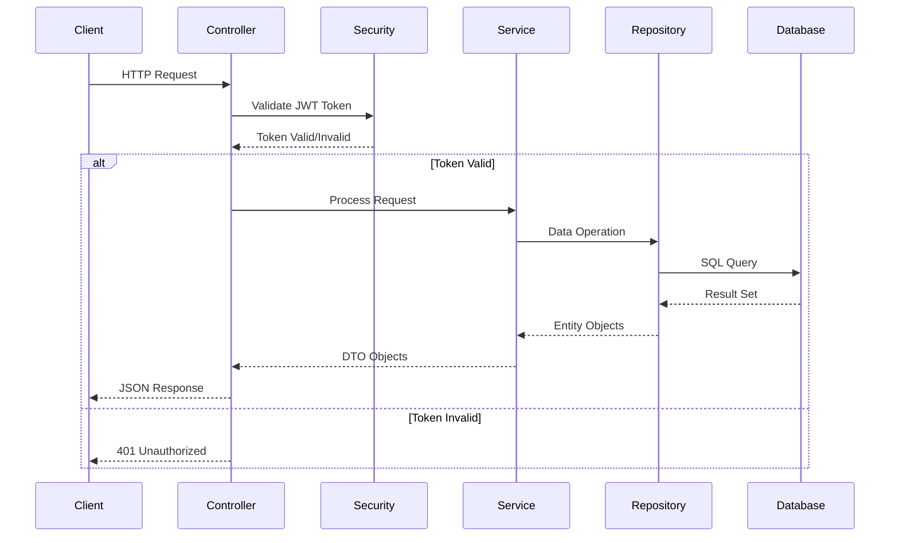
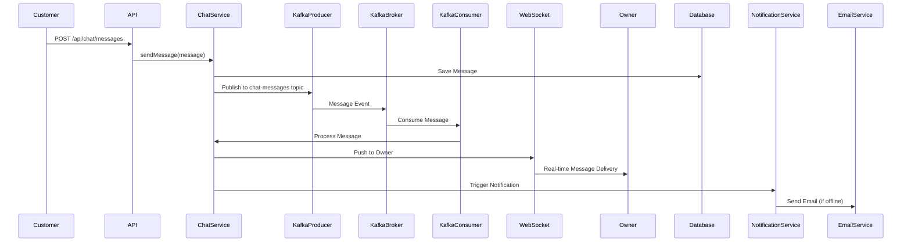
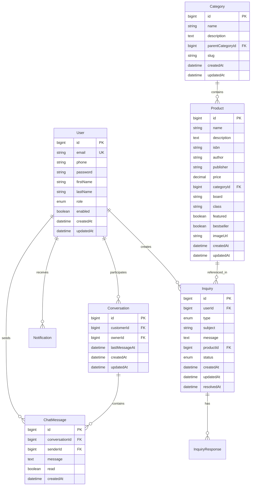
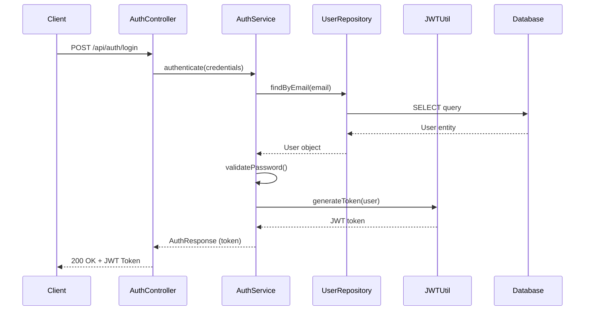
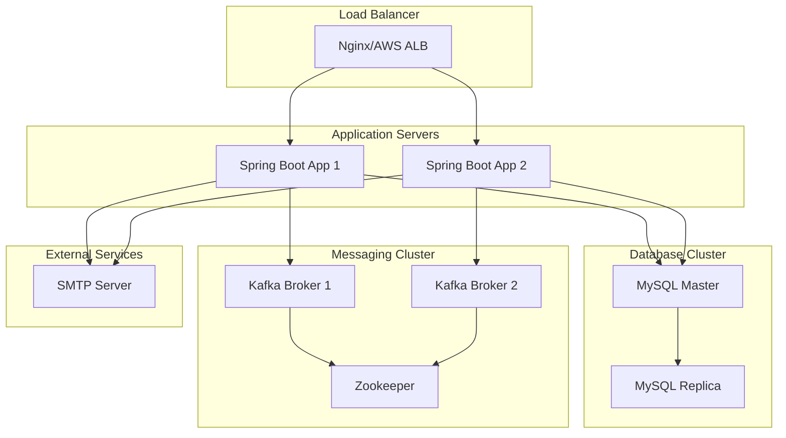

# Vidyarthi Book Depot - Main Architecture Documentation

## Overview

This document provides a comprehensive overview of the Vidyarthi Book Depot monolithic platform architecture. The system is designed as a single Spring Boot application that handles all business logic, data persistence, and real-time communication for the bookstore's inquiry and chat platform.

## Technology Stack

### Core Framework
- **Spring Boot 3.x**: Main application framework
- **Java 17+**: Programming language
- **Maven/Gradle**: Build tool and dependency management

### Persistence Layer
- **Spring Data JPA**: Data access abstraction
- **Hibernate**: ORM framework
- **MySQL 8.0+**: Relational database

### Security
- **Spring Security**: Authentication and authorization framework
- **JWT (JSON Web Tokens)**: Stateless authentication mechanism
- **BCrypt**: Password hashing algorithm

### Messaging & Real-time Communication
- **Apache Kafka**: Message broker for chat system
- **WebSocket**: Real-time bidirectional communication
- **STOMP**: Messaging protocol over WebSocket

### Additional Libraries
- **Spring Mail**: Email notification service
- **Jackson**: JSON serialization/deserialization
- **Validation API**: Input validation

## System Architecture

### High-Level Architecture Diagram



## Application Layers

### 1. Presentation Layer (Controllers)

**Purpose**: Handle HTTP requests, validate input, and return responses

**Components**:
- REST Controllers for each service domain
- WebSocket controller for real-time chat
- Global exception handler
- Request/Response DTOs

**Responsibilities**:
- Request validation
- Response formatting
- Error handling
- Authentication token extraction

### 2. Business Layer (Services)

**Purpose**: Implement business logic and orchestrate operations

**Components**:
- 7 main services (User, Product, Category, Inquiry, Chat, Notification, Auth)
- Service interfaces and implementations
- Business rule enforcement
- Transaction management

**Responsibilities**:
- Business logic implementation
- Data transformation
- Service orchestration
- Event publishing

### 3. Data Access Layer (Repositories)

**Purpose**: Abstract database operations

**Components**:
- Spring Data JPA repositories
- Custom query methods
- Entity relationships

**Responsibilities**:
- CRUD operations
- Custom queries
- Data persistence
- Transaction boundaries

### 4. Security Layer

**Purpose**: Authentication and authorization

**Components**:
- JWT filter chain
- Security configuration
- Password encoder
- Role-based access control

**Responsibilities**:
- User authentication
- Token validation
- Authorization checks
- Password encryption

### 5. Messaging Layer

**Purpose**: Real-time communication and event handling

**Components**:
- Kafka producers and consumers
- WebSocket handlers
- Message serialization

**Responsibilities**:
- Real-time message delivery
- Event publishing
- Message persistence
- Notification triggers

## Data Flow Architecture

### Request Flow



### Chat Message Flow



## Database Architecture

### Database Connection Strategy

- **Connection Pool**: HikariCP (default Spring Boot connection pool)
- **Transaction Management**: Spring's declarative transaction management
- **Lazy Loading**: Configured for optimal performance
- **Caching**: Second-level cache for frequently accessed data

### Entity Relationships



## Security Architecture

### Authentication Flow



### Authorization Strategy

- **Role-Based Access Control (RBAC)**:
  - `CUSTOMER`: Can create inquiries, chat, view products
  - `OWNER`: Full access to all resources, can respond to inquiries
  - `ADMIN`: System administration (future use)

- **Endpoint Protection**:
  - Public endpoints: Registration, Login, Product browsing
  - Protected endpoints: User profile, Inquiries, Chat
  - Owner-only endpoints: Product management, Inquiry responses

## Kafka Integration Architecture

### Topic Structure

1. **chat-messages** (Partitioned by conversationId)
   - Purpose: Real-time chat message delivery
   - Key: conversationId
   - Value: ChatMessageEvent

2. **chat-notifications** (Single partition)
   - Purpose: Notification events for chat
   - Key: userId
   - Value: NotificationEvent

3. **inquiry-notifications** (Single partition)
   - Purpose: Inquiry-related notifications
   - Key: userId
   - Value: InquiryNotificationEvent

### Kafka Consumer Groups

- **chat-consumer-group**: Consumes chat-messages for WebSocket delivery
- **notification-consumer-group**: Consumes notification events

## API Architecture

### RESTful API Design Principles

- **Resource-based URLs**: `/api/{resource}/{id}`
- **HTTP Methods**: GET (read), POST (create), PUT (update), DELETE (remove)
- **Status Codes**: Standard HTTP status codes
- **Response Format**: JSON
- **Versioning**: `/api/v1/` (future extensibility)

### API Endpoint Summary

- **Total Endpoints**: 48
- **Authentication Endpoints**: 3
- **User Management**: 5
- **Product Management**: 12
- **Category Management**: 6
- **Inquiry Management**: 10
- **Chat Management**: 8
- **Notification Management**: 4

## Deployment Architecture

### Development Environment

```
Developer Machine
├── Spring Boot Application (Port 8080)
├── MySQL Database (Port 3306)
└── Kafka Broker (Port 9092)
```

### Production Environment



## Configuration Management

### Application Properties Structure

- **Database Configuration**: Connection strings, pool settings
- **JWT Configuration**: Secret key, expiration time
- **Kafka Configuration**: Broker addresses, topic names
- **Email Configuration**: SMTP settings
- **CORS Configuration**: Allowed origins
- **Logging Configuration**: Log levels, file locations

### Environment-Specific Configurations

- `application.yml`: Base configuration
- `application-dev.yml`: Development overrides
- `application-prod.yml`: Production overrides

## Error Handling Strategy

### Global Exception Handling

- **Custom Exception Classes**: Domain-specific exceptions
- **Global Exception Handler**: Centralized error handling
- **Error Response Format**: Consistent error response structure
- **Logging**: Comprehensive error logging

### Error Response Structure

```json
{
  "timestamp": "2025-12-23T10:30:00Z",
  "status": 400,
  "error": "Bad Request",
  "message": "Validation failed",
  "path": "/api/inquiries",
  "details": [
    {
      "field": "subject",
      "message": "Subject is required"
    }
  ]
}
```

## Performance Considerations

### Caching Strategy

- **Entity Caching**: Second-level cache for User, Category entities
- **Query Result Caching**: Cache frequently accessed product lists
- **Redis Integration**: (Future) For distributed caching

### Database Optimization

- **Indexes**: On foreign keys, frequently queried fields
- **Connection Pooling**: Optimized pool size
- **Query Optimization**: Use of projections, pagination

### API Optimization

- **Pagination**: All list endpoints support pagination
- **Filtering**: Server-side filtering to reduce payload
- **Compression**: Gzip compression for responses

## Monitoring and Logging

### Logging Strategy

- **Log Levels**: DEBUG (dev), INFO (prod), ERROR (all)
- **Structured Logging**: JSON format for log aggregation
- **Request/Response Logging**: HTTP request/response logging
- **Performance Logging**: Slow query logging

### Monitoring Metrics

- **Application Metrics**: Spring Actuator endpoints
- **Database Metrics**: Connection pool, query performance
- **Kafka Metrics**: Producer/consumer lag, throughput
- **Business Metrics**: Inquiry count, chat message count

## Scalability Considerations

### Current Architecture (Monolithic)

- **Vertical Scaling**: Increase server resources
- **Horizontal Scaling**: Multiple instances behind load balancer
- **Database Scaling**: Read replicas for read-heavy operations

### Future Migration Path

- **Microservices**: Can be split into services if needed
- **Service Boundaries**: Already defined by service layer
- **API Gateway**: Can be added for service routing

## Technology Versions

- **Spring Boot**: 3.2.x
- **Java**: 17
- **MySQL**: 8.0+
- **Kafka**: 3.5.x
- **Spring Security**: 6.2.x
- **JWT**: jjwt 0.12.x

## Project Structure

```
src/
├── main/
│   ├── java/
│   │   └── com/
│   │       └── vidyarthibookdepot/
│   │           ├── VidyarthiBookDepotApplication.java
│   │           ├── config/
│   │           │   ├── SecurityConfig.java
│   │           │   ├── KafkaConfig.java
│   │           │   └── WebSocketConfig.java
│   │           ├── controller/
│   │           │   ├── AuthController.java
│   │           │   ├── UserController.java
│   │           │   ├── ProductController.java
│   │           │   ├── CategoryController.java
│   │           │   ├── InquiryController.java
│   │           │   ├── ChatController.java
│   │           │   └── NotificationController.java
│   │           ├── service/
│   │           │   ├── AuthService.java
│   │           │   ├── UserService.java
│   │           │   ├── ProductService.java
│   │           │   ├── CategoryService.java
│   │           │   ├── InquiryService.java
│   │           │   ├── ChatService.java
│   │           │   └── NotificationService.java
│   │           ├── repository/
│   │           │   ├── UserRepository.java
│   │           │   ├── ProductRepository.java
│   │           │   ├── CategoryRepository.java
│   │           │   ├── InquiryRepository.java
│   │           │   ├── ChatRepository.java
│   │           │   └── NotificationRepository.java
│   │           ├── entity/
│   │           │   ├── User.java
│   │           │   ├── Product.java
│   │           │   ├── Category.java
│   │           │   ├── Inquiry.java
│   │           │   ├── InquiryResponse.java
│   │           │   ├── Conversation.java
│   │           │   ├── ChatMessage.java
│   │           │   └── Notification.java
│   │           ├── dto/
│   │           │   ├── request/
│   │           │   └── response/
│   │           ├── security/
│   │           │   ├── JwtAuthenticationFilter.java
│   │           │   ├── JwtTokenProvider.java
│   │           │   └── UserPrincipal.java
│   │           ├── kafka/
│   │           │   ├── producer/
│   │           │   └── consumer/
│   │           └── exception/
│   │               ├── GlobalExceptionHandler.java
│   │               └── CustomException.java
│   └── resources/
│       ├── application.yml
│       ├── application-dev.yml
│       ├── application-prod.yml
│       └── db/
│           └── migration/
│               └── V1__Initial_schema.sql
└── test/
    └── java/
        └── com/
            └── vidyarthibookdepot/
                └── [test classes]
```

## Next Steps

1. Review individual service documentation for detailed API specifications
2. Review database schema documentation for entity relationships
3. Review deployment guide for setup instructions
4. Review API documentation for endpoint details and examples

