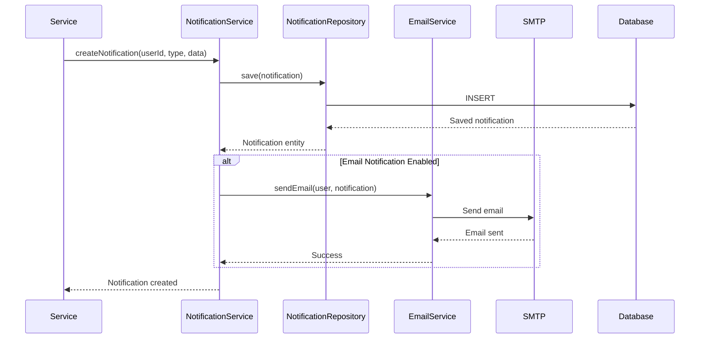
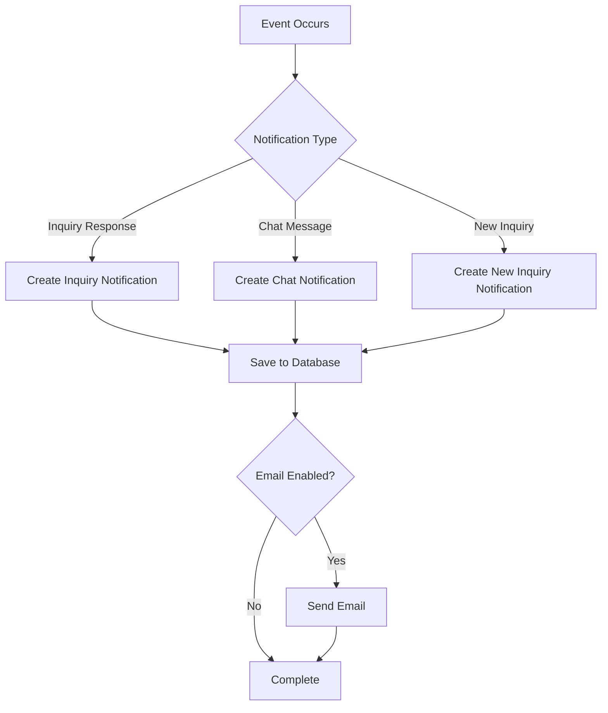
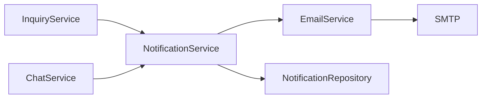

# Notification Service Documentation

## Overview

The Notification Service handles all notification-related operations including in-app notifications and email notifications. It integrates with the inquiry and chat services to send notifications for various events.

## Service Responsibilities

- In-app notification management
- Email notification sending
- Notification preferences management
- Unread notification counting
- Notification history
- Integration with SMTP server

## API Endpoints

### 1. Get User Notifications

**Endpoint**: `GET /api/notifications`

**Description**: Get paginated list of notifications for current user

**Headers**: `Authorization: Bearer {token}`

**Query Parameters**:
- `page` (int, default: 0): Page number
- `size` (int, default: 20): Page size
- `read` (Boolean, optional): Filter by read status
- `type` (String, optional): Filter by notification type

**Response**: `200 OK`
```json
{
  "content": [
    {
      "id": 1,
      "type": "INQUIRY_RESPONSE",
      "title": "Response to your inquiry",
      "message": "Store owner has responded to your inquiry about Mathematics Class 10",
      "read": false,
      "relatedEntityId": 1,
      "relatedEntityType": "INQUIRY",
      "createdAt": "2025-12-23T10:00:00Z"
    },
    {
      "id": 2,
      "type": "CHAT_MESSAGE",
      "title": "New message",
      "message": "You have a new message from Store Owner",
      "read": true,
      "relatedEntityId": 1,
      "relatedEntityType": "CONVERSATION",
      "createdAt": "2025-12-23T09:00:00Z"
    }
  ],
  "page": 0,
  "size": 20,
  "totalElements": 15,
  "totalPages": 1
}
```

**Authorization**: Requires authentication

**Notification Types**:
- `INQUIRY_RESPONSE`: Response to customer inquiry
- `CHAT_MESSAGE`: New chat message
- `INQUIRY_CREATED`: New inquiry created (for owner)
- `SYSTEM`: System notifications

### 2. Mark Notification as Read

**Endpoint**: `PUT /api/notifications/{id}/read`

**Description**: Mark a notification as read

**Headers**: `Authorization: Bearer {token}`

**Path Parameters**:
- `id` (Long): Notification ID

**Response**: `200 OK`
```json
{
  "id": 1,
  "read": true,
  "readAt": "2025-12-23T11:00:00Z"
}
```

**Authorization**: Requires authentication
- Can only mark own notifications as read

**Error Responses**:
- `404 Not Found`: Notification not found
- `403 Forbidden`: Not authorized to update this notification

### 3. Mark All Notifications as Read

**Endpoint**: `PUT /api/notifications/read-all`

**Description**: Mark all notifications for current user as read

**Headers**: `Authorization: Bearer {token}`

**Response**: `200 OK`
```json
{
  "updatedCount": 10,
  "message": "All notifications marked as read"
}
```

**Authorization**: Requires authentication

### 4. Get Unread Notification Count

**Endpoint**: `GET /api/notifications/unread-count`

**Description**: Get count of unread notifications for current user

**Headers**: `Authorization: Bearer {token}`

**Response**: `200 OK`
```json
{
  "unreadCount": 5,
  "byType": {
    "INQUIRY_RESPONSE": 2,
    "CHAT_MESSAGE": 3
  }
}
```

**Authorization**: Requires authentication

## Notification Flow



## Notification Entity

```java
@Entity
@Table(name = "notifications")
public class Notification {
    @Id
    @GeneratedValue(strategy = GenerationType.IDENTITY)
    private Long id;
    
    @ManyToOne
    @JoinColumn(name = "user_id", nullable = false)
    private User user;
    
    @Enumerated(EnumType.STRING)
    @Column(nullable = false)
    private NotificationType type;
    
    @Column(nullable = false)
    private String title;
    
    @Column(nullable = false, columnDefinition = "TEXT")
    private String message;
    
    @Column(nullable = false)
    private Boolean read = false;
    
    @Column(name = "related_entity_id")
    private Long relatedEntityId;
    
    @Enumerated(EnumType.STRING)
    @Column(name = "related_entity_type")
    private RelatedEntityType relatedEntityType;
    
    @CreationTimestamp
    private LocalDateTime createdAt;
    
    @Column(name = "read_at")
    private LocalDateTime readAt;
}
```

## Notification Types

```java
public enum NotificationType {
    INQUIRY_RESPONSE,    // Response to customer inquiry
    CHAT_MESSAGE,        // New chat message
    INQUIRY_CREATED,     // New inquiry created (for owner)
    SYSTEM              // System notifications
}
```

## Service Methods

### NotificationService Interface

```java
public interface NotificationService {
    NotificationDTO createNotification(CreateNotificationRequest request);
    Page<NotificationDTO> getNotifications(Long userId, NotificationFilter filter, Pageable pageable);
    NotificationDTO markAsRead(Long notificationId, Long userId);
    int markAllAsRead(Long userId);
    UnreadCountDTO getUnreadCount(Long userId);
    void notifyInquiryResponse(Inquiry inquiry, InquiryResponse response);
    void notifyChatMessage(ChatMessage message);
    void notifyNewInquiry(Inquiry inquiry);
    void sendEmailNotification(User user, Notification notification);
}
```

## Email Notification Integration

### Email Service

```java
@Service
public class EmailService {
    @Autowired
    private JavaMailSender mailSender;
    
    public void sendInquiryResponseEmail(User customer, Inquiry inquiry, InquiryResponse response) {
        MimeMessage message = mailSender.createMimeMessage();
        MimeMessageHelper helper = new MimeMessageHelper(message);
        
        helper.setTo(customer.getEmail());
        helper.setSubject("Response to your inquiry: " + inquiry.getSubject());
        helper.setText(buildEmailBody(inquiry, response), true);
        
        mailSender.send(message);
    }
    
    public void sendChatMessageEmail(User recipient, ChatMessage message) {
        // Similar implementation for chat messages
    }
}
```

### Email Templates

**Inquiry Response Email**:
```html
<!DOCTYPE html>
<html>
<head>
    <title>Response to Your Inquiry</title>
</head>
<body>
    <h2>Response to Your Inquiry</h2>
    <p>Dear {{customerName}},</p>
    <p>We have responded to your inquiry:</p>
    <p><strong>Subject:</strong> {{inquirySubject}}</p>
    <p><strong>Response:</strong></p>
    <p>{{responseMessage}}</p>
    <p>You can view the full response on our website.</p>
    <p>Best regards,<br>Vidyarthi Book Depot</p>
</body>
</html>
```

**Chat Message Email**:
```html
<!DOCTYPE html>
<html>
<head>
    <title>New Message</title>
</head>
<body>
    <h2>New Message from Vidyarthi Book Depot</h2>
    <p>Dear {{customerName}},</p>
    <p>You have received a new message:</p>
    <p>{{message}}</p>
    <p><a href="{{chatUrl}}">View Conversation</a></p>
    <p>Best regards,<br>Vidyarthi Book Depot</p>
</body>
</html>
```

## Notification Creation Flow



## Integration with Other Services



### Inquiry Service Integration

```java
// In InquiryService
public InquiryResponseDTO addResponse(Long inquiryId, String message, Long userId) {
    Inquiry inquiry = findById(inquiryId);
    InquiryResponse response = createResponse(inquiry, message, userId);
    
    // Trigger notification
    notificationService.notifyInquiryResponse(inquiry, response);
    
    return mapToDTO(response);
}
```

### Chat Service Integration

```java
// In ChatService
public ChatMessageDTO sendMessage(Long conversationId, String message, Long senderId) {
    ChatMessage chatMessage = createMessage(conversationId, message, senderId);
    
    // Trigger notification
    notificationService.notifyChatMessage(chatMessage);
    
    return mapToDTO(chatMessage);
}
```

## Database Queries

### Optimized Queries

**Get Notifications with Filters**:
```sql
SELECT 
    n.id,
    n.type,
    n.title,
    n.message,
    n.read,
    n.related_entity_id,
    n.related_entity_type,
    n.created_at
FROM notifications n
WHERE n.user_id = :userId
    AND (:read IS NULL OR n.read = :read)
    AND (:type IS NULL OR n.type = :type)
ORDER BY n.created_at DESC
LIMIT :size OFFSET :offset
```

**Get Unread Count**:
```sql
SELECT 
    n.type,
    COUNT(*) as count
FROM notifications n
WHERE n.user_id = :userId
    AND n.read = false
GROUP BY n.type
```

## Performance Considerations

### Indexing

- **Primary Key**: id (auto-indexed)
- **Indexes**: userId, type, read, createdAt
- **Composite Index**: (userId, read, createdAt) for notification queries
- **Composite Index**: (userId, type) for type-based queries

### Caching

- **Unread Count Cache**: Cache unread counts (1-minute TTL)
- **Recent Notifications Cache**: Cache recent notifications (5-minute TTL)

### Email Performance

- **Async Email Sending**: Send emails asynchronously to avoid blocking
- **Email Queue**: (Future) Use message queue for email delivery
- **Batch Processing**: Batch email sending for efficiency

## Error Handling

### Custom Exceptions

- **NotificationNotFoundException**: When notification is not found
- **EmailSendingException**: When email sending fails
- **InvalidNotificationTypeException**: When notification type is invalid

## Email Configuration

### Application Properties

```yaml
spring:
  mail:
    host: smtp.gmail.com
    port: 587
    username: ${EMAIL_USERNAME}
    password: ${EMAIL_PASSWORD}
    properties:
      mail:
        smtp:
          auth: true
          starttls:
            enable: true
```

## Testing Considerations

### Unit Tests
- Notification creation
- Email template rendering
- Unread count calculation
- Mark as read functionality

### Integration Tests
- Complete notification flow
- Email sending
- Notification filtering
- Error scenarios

## Security Considerations

1. **Email Validation**: Validate email addresses before sending
2. **Rate Limiting**: Limit email sending rate
3. **Email Content**: Sanitize email content
4. **User Privacy**: Only send notifications to authorized users

## Business Rules

1. **Notification Creation**: Notifications created for relevant events
2. **Email Sending**: Email sent based on user preferences
3. **Read Status**: Read status tracked per notification
4. **Notification Retention**: Notifications retained for 90 days (configurable)
5. **Batch Operations**: Support for bulk read operations

## Future Enhancements

- Push notifications (mobile)
- SMS notifications
- Notification preferences per type
- Notification grouping
- Rich notifications with actions
- Notification scheduling
- Notification analytics
- Custom notification templates

