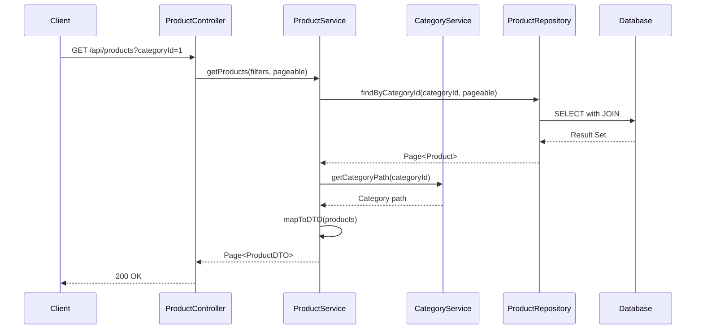
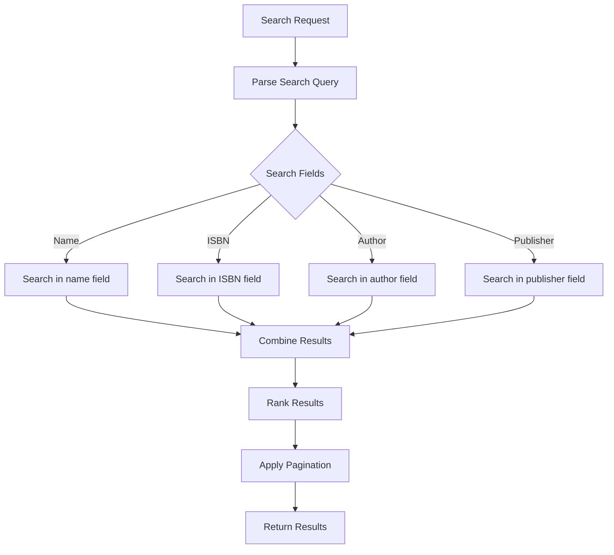
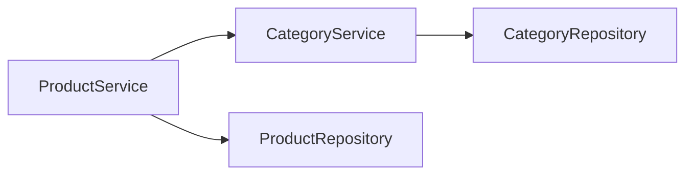

# Product Service Documentation

## Overview

The Product Service manages the bookstore's product catalog. It handles product creation, retrieval, searching, filtering, and categorization. Products can be browsed by customers and managed by the owner.

## Service Responsibilities

- Product CRUD operations
- Product search and filtering
- Category-based product organization
- Board-based filtering (SSC, HSC, ICSE, CBSE)
- Class/grade filtering
- Featured, bestseller, and trending product management
- Product image management

## API Endpoints

### 1. List Products

**Endpoint**: `GET /api/products`

**Description**: Get paginated list of products with optional filters

**Query Parameters**:
- `page` (int, default: 0): Page number
- `size` (int, default: 20): Page size
- `categoryId` (Long, optional): Filter by category
- `board` (String, optional): Filter by board (SSC, HSC, ICSE, CBSE)
- `class` (String, optional): Filter by class/grade
- `search` (String, optional): Search by name or ISBN
- `featured` (Boolean, optional): Filter featured products
- `bestseller` (Boolean, optional): Filter bestseller products
- `sort` (String, optional): Sort field (name, price, createdAt)
- `direction` (String, optional): Sort direction (ASC, DESC)

**Response**: `200 OK`
```json
{
  "content": [
    {
      "id": 1,
      "name": "Mathematics for Class 10",
      "description": "Comprehensive mathematics textbook for SSC board",
      "isbn": "978-1234567890",
      "author": "Dr. Ramesh Kumar",
      "publisher": "Educational Publishers",
      "price": 450.00,
      "categoryId": 1,
      "categoryName": "School Books",
      "board": "SSC",
      "class": "10",
      "featured": true,
      "bestseller": false,
      "imageUrl": "/images/products/math-10.jpg",
      "createdAt": "2025-12-23T10:00:00Z"
    }
  ],
  "page": 0,
  "size": 20,
  "totalElements": 150,
  "totalPages": 8
}
```

**Authorization**: Public (no authentication required)

### 2. Get Product Details

**Endpoint**: `GET /api/products/{id}`

**Description**: Get detailed information about a specific product

**Path Parameters**:
- `id` (Long): Product ID

**Response**: `200 OK`
```json
{
  "id": 1,
  "name": "Mathematics for Class 10",
  "description": "Comprehensive mathematics textbook for SSC board covering all topics...",
  "isbn": "978-1234567890",
  "author": "Dr. Ramesh Kumar",
  "publisher": "Educational Publishers",
  "price": 450.00,
  "categoryId": 1,
  "categoryName": "School Books",
  "categoryPath": "School Books > SSC > Class 10",
  "board": "SSC",
  "class": "10",
  "featured": true,
  "bestseller": false,
  "imageUrl": "/images/products/math-10.jpg",
  "createdAt": "2025-12-23T10:00:00Z",
  "updatedAt": "2025-12-23T10:00:00Z"
}
```

**Error Responses**:
- `404 Not Found`: Product not found

**Authorization**: Public

### 3. Search Products

**Endpoint**: `GET /api/products/search`

**Description**: Search products by name, ISBN, author, or publisher

**Query Parameters**:
- `q` (String, required): Search query
- `page` (int, default: 0): Page number
- `size` (int, default: 20): Page size

**Response**: `200 OK`
```json
{
  "content": [
    {
      "id": 1,
      "name": "Mathematics for Class 10",
      "isbn": "978-1234567890",
      "author": "Dr. Ramesh Kumar",
      "price": 450.00,
      "imageUrl": "/images/products/math-10.jpg"
    }
  ],
  "page": 0,
  "size": 20,
  "totalElements": 5
}
```

**Authorization**: Public

### 4. Get Products by Category

**Endpoint**: `GET /api/products/category/{categoryId}`

**Description**: Get all products in a specific category

**Path Parameters**:
- `categoryId` (Long): Category ID

**Query Parameters**:
- `page` (int, default: 0): Page number
- `size` (int, default: 20): Page size

**Response**: `200 OK` (Same structure as List Products)

**Authorization**: Public

### 5. Get Products by Board

**Endpoint**: `GET /api/products/board/{board}`

**Description**: Get products filtered by educational board

**Path Parameters**:
- `board` (String): Board name (SSC, HSC, ICSE, CBSE)

**Query Parameters**:
- `page` (int, default: 0): Page number
- `size` (int, default: 20): Page size

**Response**: `200 OK` (Same structure as List Products)

**Authorization**: Public

**Valid Board Values**: SSC, HSC, ICSE, CBSE

### 6. Get Products by Class

**Endpoint**: `GET /api/products/class/{class}`

**Description**: Get products filtered by class/grade

**Path Parameters**:
- `class` (String): Class/grade (e.g., "10", "12", "First Year")

**Query Parameters**:
- `page` (int, default: 0): Page number
- `size` (int, default: 20): Page size

**Response**: `200 OK` (Same structure as List Products)

**Authorization**: Public

### 7. Create Product

**Endpoint**: `POST /api/products`

**Description**: Create a new product (owner only)

**Headers**: `Authorization: Bearer {token}`

**Request Body**:
```json
{
  "name": "Physics for Class 12",
  "description": "Advanced physics textbook for HSC board",
  "isbn": "978-1234567891",
  "author": "Dr. Suresh Patel",
  "publisher": "Science Publishers",
  "price": 550.00,
  "categoryId": 1,
  "board": "HSC",
  "class": "12",
  "featured": false,
  "bestseller": true,
  "imageUrl": "/images/products/physics-12.jpg"
}
```

**Response**: `201 Created`
```json
{
  "id": 2,
  "name": "Physics for Class 12",
  "description": "Advanced physics textbook for HSC board",
  "isbn": "978-1234567891",
  "author": "Dr. Suresh Patel",
  "publisher": "Science Publishers",
  "price": 550.00,
  "categoryId": 1,
  "board": "HSC",
  "class": "12",
  "featured": false,
  "bestseller": true,
  "imageUrl": "/images/products/physics-12.jpg",
  "createdAt": "2025-12-23T11:00:00Z"
}
```

**Authorization**: OWNER only

**Validation Rules**:
- Name is required
- ISBN must be unique
- Price must be positive
- Category must exist

### 8. Update Product

**Endpoint**: `PUT /api/products/{id}`

**Description**: Update an existing product (owner only)

**Headers**: `Authorization: Bearer {token}`

**Path Parameters**:
- `id` (Long): Product ID

**Request Body**: (Same as Create Product, all fields optional)

**Response**: `200 OK` (Updated product)

**Authorization**: OWNER only

**Error Responses**:
- `404 Not Found`: Product not found

### 9. Delete Product

**Endpoint**: `DELETE /api/products/{id}`

**Description**: Delete a product (owner only)

**Headers**: `Authorization: Bearer {token}`

**Path Parameters**:
- `id` (Long): Product ID

**Response**: `204 No Content`

**Authorization**: OWNER only

**Error Responses**:
- `404 Not Found`: Product not found
- `409 Conflict`: Product has associated inquiries

### 10. Get Featured Products

**Endpoint**: `GET /api/products/featured`

**Description**: Get all featured products

**Query Parameters**:
- `limit` (int, default: 10): Maximum number of products

**Response**: `200 OK`
```json
[
  {
    "id": 1,
    "name": "Mathematics for Class 10",
    "price": 450.00,
    "imageUrl": "/images/products/math-10.jpg"
  }
]
```

**Authorization**: Public

### 11. Get Bestseller Products

**Endpoint**: `GET /api/products/bestsellers`

**Description**: Get all bestseller products

**Query Parameters**:
- `limit` (int, default: 10): Maximum number of products

**Response**: `200 OK` (Same structure as Featured Products)

**Authorization**: Public

### 12. Get Trending Products

**Endpoint**: `GET /api/products/trending`

**Description**: Get trending products (based on inquiry count or views)

**Query Parameters**:
- `limit` (int, default: 10): Maximum number of products
- `period` (String, optional): Time period (WEEK, MONTH, YEAR)

**Response**: `200 OK` (Same structure as Featured Products)

**Authorization**: Public

## Service Flow



## Product Entity

```java
@Entity
@Table(name = "products")
public class Product {
    @Id
    @GeneratedValue(strategy = GenerationType.IDENTITY)
    private Long id;
    
    @Column(nullable = false)
    private String name;
    
    @Column(columnDefinition = "TEXT")
    private String description;
    
    @Column(unique = true)
    private String isbn;
    
    private String author;
    private String publisher;
    
    @Column(nullable = false)
    private BigDecimal price;
    
    @ManyToOne
    @JoinColumn(name = "category_id")
    private Category category;
    
    private String board; // SSC, HSC, ICSE, CBSE
    private String class; // Class/Grade
    
    private Boolean featured;
    private Boolean bestseller;
    
    private String imageUrl;
    
    @CreationTimestamp
    private LocalDateTime createdAt;
    
    @UpdateTimestamp
    private LocalDateTime updatedAt;
}
```

## Service Methods

### ProductService Interface

```java
public interface ProductService {
    Page<ProductDTO> getProducts(ProductFilter filter, Pageable pageable);
    ProductDTO getProductById(Long id);
    Page<ProductDTO> searchProducts(String query, Pageable pageable);
    Page<ProductDTO> getProductsByCategory(Long categoryId, Pageable pageable);
    Page<ProductDTO> getProductsByBoard(String board, Pageable pageable);
    Page<ProductDTO> getProductsByClass(String className, Pageable pageable);
    ProductDTO createProduct(CreateProductRequest request);
    ProductDTO updateProduct(Long id, UpdateProductRequest request);
    void deleteProduct(Long id);
    List<ProductDTO> getFeaturedProducts(int limit);
    List<ProductDTO> getBestsellerProducts(int limit);
    List<ProductDTO> getTrendingProducts(int limit, String period);
}
```

## Search and Filtering Logic

### Search Implementation



### Filtering Strategy

- **Category Filter**: Uses JOIN with categories table
- **Board Filter**: Direct WHERE clause on board column
- **Class Filter**: Direct WHERE clause on class column
- **Combined Filters**: Uses AND conditions for multiple filters
- **Indexing**: Indexes on categoryId, board, class for performance

## Database Queries

### Optimized Query Example

```sql
SELECT p.*, c.name as category_name
FROM products p
LEFT JOIN categories c ON p.category_id = c.id
WHERE 
    (:categoryId IS NULL OR p.category_id = :categoryId)
    AND (:board IS NULL OR p.board = :board)
    AND (:class IS NULL OR p.class = :class)
    AND (:search IS NULL OR 
         p.name LIKE %:search% OR 
         p.isbn LIKE %:search% OR
         p.author LIKE %:search%)
ORDER BY p.created_at DESC
LIMIT :size OFFSET :offset
```

## Performance Considerations

### Caching Strategy

- **Product List Cache**: Cache frequently accessed product lists
- **Product Detail Cache**: Cache individual product details
- **Category Products Cache**: Cache products by category
- **Cache Invalidation**: Invalidate on product create/update/delete

### Indexing

- **Primary Key**: id (auto-indexed)
- **Unique Index**: isbn
- **Indexes**: categoryId, board, class, featured, bestseller
- **Full-Text Index**: name, description (for search)

### Pagination

- All list endpoints support pagination
- Default page size: 20
- Maximum page size: 100
- Efficient offset-based pagination

## Error Handling

### Custom Exceptions

- **ProductNotFoundException**: When product is not found
- **ISBNAlreadyExistsException**: When ISBN is duplicate
- **CategoryNotFoundException**: When category doesn't exist
- **InvalidProductDataException**: When validation fails

## Integration with Other Services

### Category Service Integration



- Product Service calls Category Service to validate category existence
- Category Service provides category path for product display

## Testing Considerations

### Unit Tests
- Product creation with valid/invalid data
- Search functionality
- Filtering logic
- Pagination

### Integration Tests
- Complete CRUD operations
- Search with multiple criteria
- Filter combinations
- Category validation

## Future Enhancements

- Product reviews and ratings
- Product recommendations
- Inventory tracking (if needed)
- Bulk product import
- Product variants (editions, formats)
- Advanced search with facets

