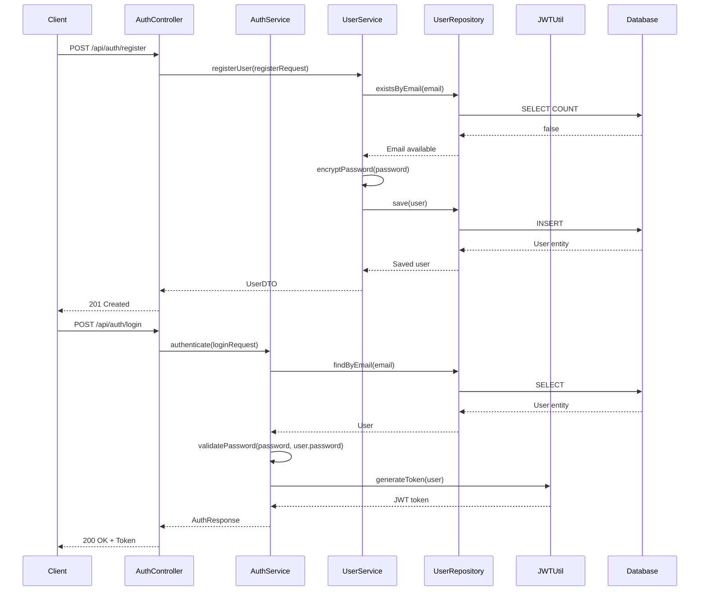
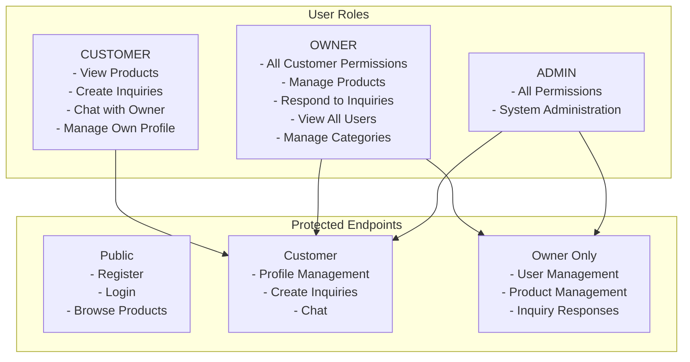

# User Service Documentation

## Overview

The User Service handles all user-related operations including registration, authentication, profile management, and user administration. It provides JWT-based authentication and role-based access control.

## Service Responsibilities

- User registration and account creation
- User authentication (login/logout)
- JWT token generation and validation
- User profile management
- Role management (CUSTOMER, OWNER, ADMIN)
- Password encryption and validation
- User account status management

## API Endpoints

### 1. User Registration

**Endpoint**: `POST /api/auth/register`

**Description**: Register a new user account

**Request Body**:
```json
{
  "email": "customer@example.com",
  "phone": "+919876543210",
  "password": "SecurePassword123!",
  "firstName": "John",
  "lastName": "Doe"
}
```

**Response**: `201 Created`
```json
{
  "id": 1,
  "email": "customer@example.com",
  "phone": "+919876543210",
  "firstName": "John",
  "lastName": "Doe",
  "role": "CUSTOMER",
  "enabled": true,
  "createdAt": "2025-12-23T10:00:00Z"
}
```

**Validation Rules**:
- Email must be valid and unique
- Phone must be valid format
- Password: min 8 characters, at least one uppercase, one lowercase, one number
- First name and last name are required

**Error Responses**:
- `400 Bad Request`: Validation errors
- `409 Conflict`: Email already exists

### 2. User Login

**Endpoint**: `POST /api/auth/login`

**Description**: Authenticate user and return JWT token

**Request Body**:
```json
{
  "email": "customer@example.com",
  "password": "SecurePassword123!"
}
```

**Response**: `200 OK`
```json
{
  "token": "eyJhbGciOiJIUzI1NiIsInR5cCI6IkpXVCJ9...",
  "type": "Bearer",
  "expiresIn": 3600,
  "user": {
    "id": 1,
    "email": "customer@example.com",
    "firstName": "John",
    "lastName": "Doe",
    "role": "CUSTOMER"
  }
}
```

**Error Responses**:
- `401 Unauthorized`: Invalid credentials
- `403 Forbidden`: Account disabled

### 3. Refresh Token

**Endpoint**: `POST /api/auth/refresh`

**Description**: Refresh JWT token using refresh token

**Headers**: `Authorization: Bearer {token}`

**Request Body**:
```json
{
  "refreshToken": "eyJhbGciOiJIUzI1NiIsInR5cCI6IkpXVCJ9..."
}
```

**Response**: `200 OK`
```json
{
  "token": "eyJhbGciOiJIUzI1NiIsInR5cCI6IkpXVCJ9...",
  "type": "Bearer",
  "expiresIn": 3600
}
```

**Error Responses**:
- `401 Unauthorized`: Invalid or expired refresh token

### 4. Get Current User Profile

**Endpoint**: `GET /api/users/profile`

**Description**: Get authenticated user's profile

**Headers**: `Authorization: Bearer {token}`

**Response**: `200 OK`
```json
{
  "id": 1,
  "email": "customer@example.com",
  "phone": "+919876543210",
  "firstName": "John",
  "lastName": "Doe",
  "role": "CUSTOMER",
  "enabled": true,
  "createdAt": "2025-12-23T10:00:00Z",
  "updatedAt": "2025-12-23T10:00:00Z"
}
```

**Authorization**: Requires authentication

### 5. Update User Profile

**Endpoint**: `PUT /api/users/profile`

**Description**: Update authenticated user's profile

**Headers**: `Authorization: Bearer {token}`

**Request Body**:
```json
{
  "phone": "+919876543211",
  "firstName": "Jane",
  "lastName": "Smith"
}
```

**Response**: `200 OK`
```json
{
  "id": 1,
  "email": "customer@example.com",
  "phone": "+919876543211",
  "firstName": "Jane",
  "lastName": "Smith",
  "role": "CUSTOMER",
  "enabled": true,
  "updatedAt": "2025-12-23T11:00:00Z"
}
```

**Authorization**: Requires authentication
**Note**: Email cannot be changed

### 6. Get User by ID

**Endpoint**: `GET /api/users/{id}`

**Description**: Get user details by ID

**Headers**: `Authorization: Bearer {token}`

**Path Parameters**:
- `id` (Long): User ID

**Response**: `200 OK`
```json
{
  "id": 1,
  "email": "customer@example.com",
  "phone": "+919876543210",
  "firstName": "John",
  "lastName": "Doe",
  "role": "CUSTOMER",
  "enabled": true
}
```

**Authorization**: OWNER or ADMIN only

### 7. Update User Role

**Endpoint**: `PUT /api/users/{id}/role`

**Description**: Update user role (for owner/admin)

**Headers**: `Authorization: Bearer {token}`

**Path Parameters**:
- `id` (Long): User ID

**Request Body**:
```json
{
  "role": "OWNER"
}
```

**Response**: `200 OK`
```json
{
  "id": 1,
  "email": "customer@example.com",
  "role": "OWNER",
  "updatedAt": "2025-12-23T11:00:00Z"
}
```

**Authorization**: OWNER only
**Valid Roles**: CUSTOMER, OWNER, ADMIN

### 8. List All Users

**Endpoint**: `GET /api/users`

**Description**: Get paginated list of all users

**Headers**: `Authorization: Bearer {token}`

**Query Parameters**:
- `page` (int, default: 0): Page number
- `size` (int, default: 20): Page size
- `role` (String, optional): Filter by role
- `enabled` (Boolean, optional): Filter by enabled status

**Response**: `200 OK`
```json
{
  "content": [
    {
      "id": 1,
      "email": "customer@example.com",
      "firstName": "John",
      "lastName": "Doe",
      "role": "CUSTOMER",
      "enabled": true
    }
  ],
  "page": 0,
  "size": 20,
  "totalElements": 100,
  "totalPages": 5
}
```

**Authorization**: OWNER only

## Authentication Flow



## Security Implementation

### JWT Token Structure

**Header**:
```json
{
  "alg": "HS256",
  "typ": "JWT"
}
```

**Payload**:
```json
{
  "sub": "customer@example.com",
  "userId": 1,
  "role": "CUSTOMER",
  "iat": 1703328000,
  "exp": 1703331600
}
```

### Password Encryption

- **Algorithm**: BCrypt
- **Strength**: 10 rounds
- **Storage**: Hashed password stored in database
- **Validation**: BCrypt password matching

### Role-Based Access Control



## Service Implementation Details

### User Entity

```java
@Entity
@Table(name = "users")
public class User {
    @Id
    @GeneratedValue(strategy = GenerationType.IDENTITY)
    private Long id;
    
    @Column(unique = true, nullable = false)
    private String email;
    
    private String phone;
    
    @Column(nullable = false)
    private String password;
    
    private String firstName;
    private String lastName;
    
    @Enumerated(EnumType.STRING)
    private Role role;
    
    private Boolean enabled;
    
    @CreationTimestamp
    private LocalDateTime createdAt;
    
    @UpdateTimestamp
    private LocalDateTime updatedAt;
}
```

### User Roles Enum

```java
public enum Role {
    CUSTOMER,
    OWNER,
    ADMIN
}
```

## Service Methods

### UserService Interface

```java
public interface UserService {
    UserDTO registerUser(RegisterRequest request);
    AuthResponse login(LoginRequest request);
    AuthResponse refreshToken(String refreshToken);
    UserDTO getCurrentUser();
    UserDTO updateProfile(UpdateProfileRequest request);
    UserDTO getUserById(Long id);
    UserDTO updateUserRole(Long userId, Role role);
    Page<UserDTO> getAllUsers(int page, int size, Role role, Boolean enabled);
    boolean existsByEmail(String email);
    User findByEmail(String email);
}
```

## Error Handling

### Custom Exceptions

- **EmailAlreadyExistsException**: When email is already registered
- **InvalidCredentialsException**: When login credentials are invalid
- **UserNotFoundException**: When user is not found
- **UnauthorizedException**: When user lacks required permissions
- **AccountDisabledException**: When account is disabled

## Testing Considerations

### Unit Tests
- User registration with valid/invalid data
- Password encryption verification
- JWT token generation and validation
- Role-based access control

### Integration Tests
- Complete authentication flow
- Profile update flow
- User listing with pagination
- Error scenarios

## Performance Considerations

- **Password Hashing**: BCrypt is intentionally slow (security)
- **JWT Validation**: Stateless, no database lookup required
- **User Lookup**: Indexed on email for fast queries
- **Caching**: User entities can be cached (with invalidation on update)

## Security Best Practices

1. **Password Policy**: Enforced at registration
2. **Token Expiration**: Short-lived access tokens (1 hour)
3. **Refresh Tokens**: Longer-lived for token renewal
4. **HTTPS Only**: Tokens transmitted over HTTPS in production
5. **Account Lockout**: (Future) After multiple failed login attempts
6. **Password Reset**: (Future) Secure password reset flow

